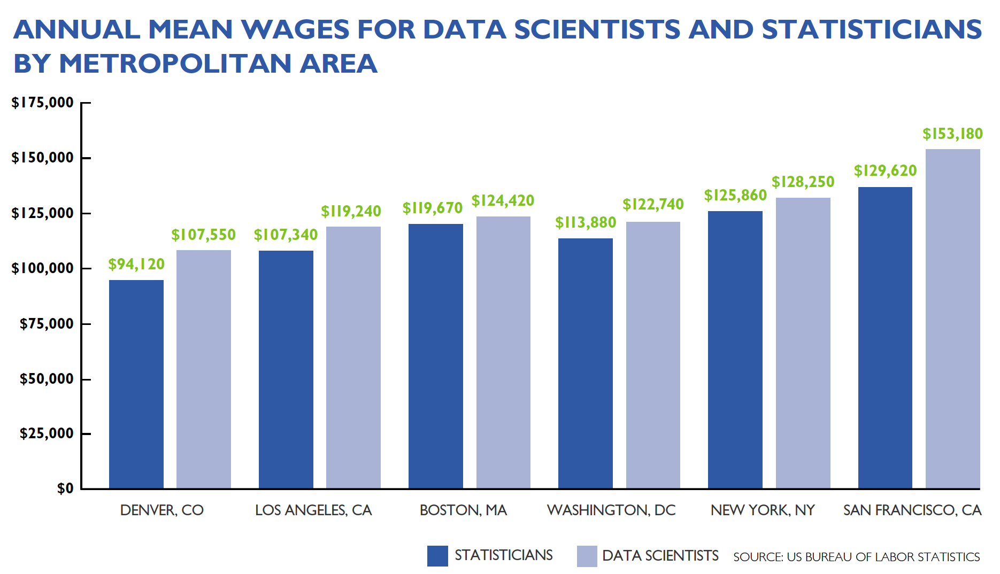

```{js, echo = FALSE}
var coll = document.getElementsByClassName("collapsible");
var i;

for (i = 0; i < coll.length; i++) {
  coll[i].addEventListener("click", function() {
    this.classList.toggle("active");
    var content = this.nextElementSibling;
    if (content.style.display === "block") {
      content.style.display = "none";
    } else {
      content.style.display = "block";
    }
  });
}

```

```{r setup, include=FALSE,warning=FALSE}
knitr::opts_chunk$set(echo = TRUE)
```


```{r include=FALSE,warning=FALSE}
#add library
library(shiny)
library(shinydashboard)
library(ConvergenceConcepts)
```

# Convergence Concepts

## What is Limit Theory?

By limit or asymptotic theory we mean we want to understand the behavior of some quantity, usually a statistic, as something changes, usually the sample size. For instance, we will investigate the behavior of the sample mean as the sample size grows. We'll look at questions like

- When the distribution of a statistic (called a **sampling distribution**) is difficult to derive *exactly*, is there a good **approximating** distribution we can use to get **approximate** probability statements about $\bar{Y}$?
- What value does $\bar{Y}$ *get close to* as the sample size grows? (We hope the population mean we are often trying to estimate, $\mu$.)

## Common Assumptions & Definitions

We must make some assumptions about how we observe our random variables in order to investigate these types of questions. For simplicity, we often assume we have a **random sample**.

Random Sample
: $Y_1,..., Y_n$ are a random sample (RS) of size $n$ if the random variables are independent and identically distributed (iid). 

We'll often say 'assume we have a random sample' from some distribution or that 'our random variables are iid' from some distribution. These are equivalent ways of stating this assumption.

We'll be interested in some function or **statistic** from the random sample.

Statistic
: A function of $Y_1,Y_2,...,Y_n$ from a random sample that does not involve any unknown parameters is called a statistic.

Commonly studied statistics:  

- $\bar{Y} = \frac{1}{n}\sum_{i=1}^n Y_i$
- $S^2 = \frac{1}{n-1}\sum_{i=1}^{n}(Y_i-\bar{Y})^2$
- $Y_{(n)} = \mbox{the maximum value from the sample}$

Quantities that aren't statistics:  

- $\frac{\bar{Y}-\mu}{S/\sqrt{n}}$ (since $\mu$ is unknown) (if we assume it is known (like when we do a test statistic) then this is a statistic)
- $\frac{(n-1)S^2}{\sigma^2}$ (since $\sigma^2$ is unknown)

One type of convergence we'll look at is focused on how these statistics are observed, that is the **sampling distribution** of the statistics.

Sampling Distribution
: The distribution of a statistic is called a sampling distribution.

Recall that a distribution is just the pattern and frequency with which we observe a random variable. With a statistic, we give this distribution the special name of sampling distribution. This is because we can think of how that distribution is formed by considering repeated samples from the population, each sample producing the statistic of interest.

## Convergence in Distribution

One of the most famous theorems in statistics is the **Central Limit Theorem** (or CLT). This is a result about the large-sample or asymptotic behavior of the sample mean. Before we look at the technical details, let's consider an example to motivate the idea!

### Motivating Example

(Should we give context to this? Something like the amount of rain delivered by storms or something? Then apply a probability calculation at the end?)

We are all statisticians, and we tend to describe anything related with numbers using average. For example, if we would like to encourage more students to pursue data science professions, the most persuasive way to show the growing value of statistics education and experience will be the following two figures. 


```{r echo=FALSE, figures-side, fig.show="hold", out.width="50%"}
<<<<<<< HEAD
#https://data.bls.gov/cew/apps/data_views/data_views.htm#tab=Tables
#https://www.bls.gov/oes/current/oes152051.htm#(2)
=======
>>>>>>> 6597e5c772367423df93672c894c8e4bc8b29967
par(mar = c(4, 4, .1, .1))


```


<div class = "clearfix"> </div>


Hopefully, the information from these figures make the point. We consider the mean because it's reliable with proven theories. Let's explore the properties of the average together so students know those numbers are trsutworthy to make their choice. 

- Suppose that $Y_i\stackrel{iid}\sim Gamma(\alpha = 5, \lambda = 1)$. (That is, assume we have a random sample from a Gamma distribution.) 
- Consider the *statistic* $\bar{Y} = \frac{1}{n}\sum_{i=1}^n Y_i$. 
- We often want to understand the *sampling distribution* of our statistic so that we can make (at least approximate) probabilistic statements about $\bar{Y}$. These will allow us to create **confidence intervals** or **hypothesis tests**, which will be studied later. Given the above example, we can calculate the confidence intervals for the average annual wage for data scientist in Boston, MA or if we can test whether or not the mean yearly income for data scientist is the same between Los Angeles, LA and Washington DC.

How to learn about the sampling distribution? 

A distribution is just the pattern and frequency with which we observe the quantity. With an assumption about how our data is generated (random sample from a gamma distribution with the given parameters), we can easily use software to generate many values of our statistic. We can then plot these values on a histogram to get an idea about the distribution!

**Here we would put stills from the app, but just hard coded, for different sample sizes so we can see the behavior. We note that as $n$ grows we start to see a roughly normally distributed curve.**

Below is the sample mean for different sample sizes 20, 50, 100 and 500 with the gamma distribution such that $Y_i\stackrel{iid}\sim Gamma(\alpha = 5, \lambda = 1)$. We randomly generate the data from known gamma distribution with a fixed sample size and find the mean. We repeat this process for that sample size 1000 times and plot the histogram below for that 1000 means under each sample size.

```{r, echo=FALSE, message=FALSE}
options(warn = -1)
library(magick)
library(ggplot2)
library(dplyr)
library(tidyr)
library(gganimate)

alpha=5
lambda=1
<<<<<<< HEAD
M=1000 #number of repetations
n20=c(0)
for (i in 1:M){
  n20[i]=mean(rgamma(n = 20, shape = alpha, scale = lambda) )
}
n50=c(0)
for (i in 1:M){
=======
N=1000
n20=c(0)
for (i in 1:N){
  n20[i]=mean(rgamma(n = 20, shape = alpha, scale = lambda) )
}
n50=c(0)
for (i in 1:N){
>>>>>>> 6597e5c772367423df93672c894c8e4bc8b29967
  n50[i]=mean(rgamma(n = 50, shape = alpha, scale = lambda) )
}

n100=c(0)
<<<<<<< HEAD
for (i in 1:M){
  n100[i]=mean(rgamma(n = 100, shape = alpha, scale = lambda) )
}
n500=c(0)
for (i in 1:M){
  n500[i]=mean(rgamma(n = 500, shape = alpha, scale = lambda) )
}
datamat=data.frame(cbind(c(rep(c(20,50,100,500),each=M)),c(n20,n50,n100,n500)))
=======
for (i in 1:N){
  n100[i]=mean(rgamma(n = 100, shape = alpha, scale = lambda) )
}
n500=c(0)
for (i in 1:N){
  n500[i]=mean(rgamma(n = 500, shape = alpha, scale = lambda) )
}
datamat=data.frame(cbind(c(rep(c(20,50,100,500),each=N)),c(n20,n50,n100,n500)))
>>>>>>> 6597e5c772367423df93672c894c8e4bc8b29967
colnames(datamat)=c("samplesize","mean")

# create ggplot2 plot
ggplot(datamat) + 
  geom_histogram(mapping=aes(x=mean,group=samplesize),bins=50,col="red",fill="red") +  theme(text = element_text(size = 15))+theme(plot.title = element_text(hjust = 0.5),plot.subtitle=element_text(hjust=0.5))+
  ggtitle("Distribution of Observed Mean values") +
  labs(subtitle=("Sample Size : {closest_state}")) +
  ylab("Absolute Frequency out of 1000") + 
  xlab("Observed Mean Value ") + 
  transition_states(samplesize)
#anim_save("gammean.gif")
```

A few questions for you:


- What shape does it look like? 
- What do we notice when the sample size increases? 
- What factor do you think will affect the the spread?
<<<<<<< HEAD

=======
>>>>>>> 6597e5c772367423df93672c894c8e4bc8b29967

The theory behind this will be introduced below.

<<<<<<< HEAD
=======
The theory behind this will be introduced below.

>>>>>>> 6597e5c772367423df93672c894c8e4bc8b29967
**Then we put the app here and have them consider different values of $\alpha$, $\lambda$, and $n$ with guidance for trying to find some 'rule' for when the normal distribution might be appropriate.**

<button type="button" class="collapsible">Key for a reliable Mean Estimate</button>
<div class="content">
<<<<<<< HEAD
**Large sample size
=======
**Sample size is greater than 30
>>>>>>> 6597e5c772367423df93672c894c8e4bc8b29967
</div>
### Definitions

We can see that there may be a distinction between the *actual* distribution and an approximating distribution. We call these by different names.

Exact Distribution:
The (sampling) distribution of a quantity that is valid for any sample size (or, occasionally, values of the parameters of the population distribution).

Large-Sample or Approximate Distribution:
A (sampling) distribution that is reasonable to use for a quantity for a *large* sample size (or occasionally other parameter values). 

We use the notation
$$Statistic \stackrel{\bullet}\sim f$$
to denote a large-sample approximating distribution.

Let's formally define convergence in distribution! Recall the Cumulative Distribution Function (or CDF) of a random variable $Y$ is defined as 
$$F_Y(y) = P(Y\leq y)$$. We define convergence in distribution via the CDF.

Convergence in Distribution:
The quantity $Y_n$ converges in distribution to $Y$ if
$$\lim_{n \rightarrow \infty} F_{Y_n}(y)=F_{Y}(y)$$
or equivalently
$$\lim_{n \rightarrow \infty} |F_{Y_n}(y)-F_{Y}(y)|=0$$
(at all points $y$ where $F_Y(y)$ is continuous)

For example, given a random sample from a distribution with finite variance, 
$$Z_n = \frac{\bar{Y}_n - \mu}{\sigma/\sqrt{n}}$$
can be shown to converge in distribution to a standard normal distribution. Here the subscript $n$ is just to explicitly note the dependence of the quantity on the sample size. We'll later show that
$$\lim_{n \rightarrow \infty} F_{Z_n}(z)=F_{Z}(z)$$
where $Z\sim N(0,1)$.


## Why do we care about limit theory? 

Ideally as our sample size grows the statistics we are using will **converge** to their *true* values, often a parameter they are estimating, in some sense. For instance, we hope that the sample mean gets closer and closer to the population mean we are interested in. Also, the distr

The convergence of random variables is important for asymptotic inference. As we can never collect infinity number of data, asymptotic result is critical to approximate the distribution of statistics of interest with finite sample size. We will discuss the most common three types of convergence.

Just for proof of concept. Notation:
<button type="button" class="collapsible">Open Collapsible</button>
<div class="content">
  * Let $X_1,X_2,\cdots,X_n$ be a sequence of iid random variables and $X$ be a random variable such that $E(X_i)=\mu, Var(X_i)=\sigma^2 < \infty, \forall i$
  * Convergence in distirbution $X_n\stackrel{d}{\rightarrow} X$
  * Convergence in probability $X_n\stackrel{p}{\rightarrow} X$
  * Convergence almost surely $X_n\stackrel{a.s.}{\rightarrow} X$
</div>


<<<<<<< HEAD
## Convergence in Distribution
* Definition $lim_{n \rightarrow \infty} F_{X_n}(x)=F_{X}(x)$, or
            $lim_{n \rightarrow \infty} |F_{X_n}(x)-F_{X}(x)|=0$
  * $F_X(x)$ is continuous
  * Cumulative Density Function (CDF)

<div class = "clearfix"> </div>
  
:::: {style="display: flex;"}

::: {}
Let's check out the empirical cumulative distribution for binomial distribution and appropriate normal distribution.
```{r, echo=FALSE,message=FALSE}
#ggplot(datamat[datamat$samplesize==500,], aes(mean)) +                      # Draw cumulative ggplot2 histogram
  #stat_ecdf(geom = "step", pad = FALSE)
library(cowplot)
p=0.6
n=100
NN=1000
=======
:::: {style="display: flex;"}

::: {}

## Convergence in Distribution
* Definition $lim_{n \rightarrow \infty} F_{X_n}(x)=F_{X}(x)$, or
            $lim_{n \rightarrow \infty} |F_{X_n}(x)-F_{X}(x)|=0$
  * $F_X(x)$ is continuous
  * Cumulative Density Function (CDF)
>>>>>>> 6597e5c772367423df93672c894c8e4bc8b29967


```{r, echo=FALSE,message=FALSE}
#ggplot(datamat[datamat$samplesize==500,], aes(mean)) +                      # Draw cumulative ggplot2 histogram
  #stat_ecdf(geom = "step", pad = FALSE)

<<<<<<< HEAD
=======
p=0.6
n=100
NN=1000
>>>>>>> 6597e5c772367423df93672c894c8e4bc8b29967
n500cdf=rbinom(NN,n,p)

ecdf <- data.frame(
  x = c(n500cdf, rnorm(NN, n*p, sqrt(n*p*(1-p)))),
   CDF= c(rep("Binormial (100,0.6)",NN), rep("Normal (60, 24)",NN))
)
ggplot(ecdf, aes(x,color=CDF)) +stat_ecdf()+
  theme(text = element_text(size = 15))+theme(plot.title = element_text(hjust = 0.5))+theme(legend.text = element_text(size=15))+ theme(legend.position = c(0.8, 0.1))+
  ggtitle("Emprical Cumulative Distribution Function") +
  ylab("Cumulative Distribution Function") + 
  xlab("Observed Mean Value ")
<<<<<<< HEAD
=======
# 
```
>>>>>>> 6597e5c772367423df93672c894c8e4bc8b29967

# 
```

<<<<<<< HEAD
:::

::: {}
This is the distribution of the means out of 1000 repetitions.

```{r, echo=FALSE,message=FALSE}
MM=1000 #number of simulation
n500cdfmean=c(0)
for (i in 1:MM){
  n500cdfmean[i]=mean(rbinom(NN,n,p))
}
n500df=data.frame(n500cdfmean)
ggplot(n500df,aes(x=n500cdfmean)) +
     geom_histogram(aes(y = ..density..),col="red",fill="green") + geom_density(alpha=.2)+ theme(text = element_text(size = 15))+theme(plot.title = element_text(hjust = 0.5),plot.subtitle=element_text(hjust=0.5))+
     ggtitle("Distribution of Observed Mean values") +
     ylab("Absolute Frequency out of 1000") + 
     xlab("Observed Mean Value ") 
```
:::
=======


```{r, include=FALSE}
#From 501 notes
#Simulate N data sets, each of size n, from an exp(1) distribution
n <- c(3, 30, 300)
N <- 50000

#list to save data values in (this is not an efficient way to create this data!)
data <- list()
for(i in 1:length(n)){ 	
    data[[i]] <- matrix(0, nrow = N, ncol = n[i])  #each row of a matrix will represent a data set
}

#Create the data - loop over sample sizes
for (j in 1:length(n)){	#loop over sample sizes
     for (i in 1:N){  #loop to create many data sets of a given sample size
           data[[j]][i,] <- rexp(n = n[j])	#store the data set in a row of the appropriate matrix
     }
}
#mean and variance for exp(1)
mu<-sigma<-1

#calculate the z statistic for each set of samples.  Apply the z-score transform to each row of values.
means1 <- apply(X = data[[1]], FUN = function(data){(mean(data)-mu)/(sigma/sqrt(n[1]))}, MARGIN = 1)
hist(means1, main = paste("Histogram of z's with n=", n[1], " from exp(1)", sep = ""), 
      xlab = "Means", prob = T)
lines(seq(from = -3, to = 3, by = 0.01), dnorm(seq(from = -3, to = 3, by = 0.01)))
 #Repeat this part for n = 30, n = 300
```

>>>>>>> 6597e5c772367423df93672c894c8e4bc8b29967

::::


```{r, include=FALSE}
#From 501 notes
#Simulate N data sets, each of size n, from an exp(1) distribution
n <- c(3, 30, 300)
N <- 50000

#list to save data values in (this is not an efficient way to create this data!)
data <- list()
for(i in 1:length(n)){ 	
    data[[i]] <- matrix(0, nrow = N, ncol = n[i])  #each row of a matrix will represent a data set
}

#Create the data - loop over sample sizes
for (j in 1:length(n)){	#loop over sample sizes
     for (i in 1:N){  #loop to create many data sets of a given sample size
           data[[j]][i,] <- rexp(n = n[j])	#store the data set in a row of the appropriate matrix
     }
}
#mean and variance for exp(1)
mu<-sigma<-1

#calculate the z statistic for each set of samples.  Apply the z-score transform to each row of values.
means1 <- apply(X = data[[1]], FUN = function(data){(mean(data)-mu)/(sigma/sqrt(n[1]))}, MARGIN = 1)
hist(means1, main = paste("Histogram of z's with n=", n[1], " from exp(1)", sep = ""), 
      xlab = "Means", prob = T)
lines(seq(from = -3, to = 3, by = 0.01), dnorm(seq(from = -3, to = 3, by = 0.01)))
 #Repeat this part for n = 30, n = 300
```

<<<<<<< HEAD
=======
:::
>>>>>>> 6597e5c772367423df93672c894c8e4bc8b29967


## Central Limit Theorem
Define $\overline{X}=\frac{1}{n} \sum_{i=1}^{n} X_i$ such that $E(X_i)=\mu, Var(X_i)=\sigma^2 < \infty, \forall i$ and $X \sim N (0, 1)$

* $\frac{\sqrt{n} (\overline{X_n}-\mu)}{\sigma} \stackrel {d} {\rightarrow} X$

<<<<<<< HEAD
```{r, echo=FALSE,message=FALSE,include=FALSE}
#this is using gamma example-discussed to just use binomial to be consistent, hisgogram of mean and density plot
=======
```{r, echo=FALSE,message=FALSE}
>>>>>>> 6597e5c772367423df93672c894c8e4bc8b29967
ggplot(datamat[datamat$samplesize==500,],aes(x=mean)) +
     geom_histogram(aes(y = ..density..),col="red",fill="green") + geom_density()+ theme(text = element_text(size = 15))+theme(plot.title = element_text(hjust = 0.5),plot.subtitle=element_text(hjust=0.5))+
     ggtitle("Distribution of Observed Mean values") +
     ylab("Absolute Frequency out of 1000") + 
     xlab("Observed Mean Value ") 
```


<<<<<<< HEAD
<div class = "clearfix"> </div>

##CLT Applied to a Sum 

$$\sum_{i=1}^{n} Y_i \stackrel{\bullet}{\sim}N(n\mu, n\sigma^2)$$

-Example: $Y_1,...,Y_{n}\stackrel{iid}{\sim}f_Y(y)=2y$ if $0<y<1$ (0 O.W.).  
Note: $E(Y)=2/3$ and $Var(Y)=1/18$.\\
Let $S=Y_1+...+Y_n$, can we approximate $P(S\leq 10)$?

Practically, why is the CLT so important?

- Suppose we know $\sigma$ and we want inference for $\mu$.
- If we get a RS $Y_1,...,Y_n$ we know 
	$\bar{Y}\stackrel{\bullet}{\sim}N(\mu,\sigma^2/n)$ ($\mu$ only unknown)
- We can make an approximate claim about $\mu$ via a confidence interval
	$$P(-1.96<Z<1.96)=0.95 \Leftrightarrow 
	P\left(-1.96<\frac{\bar{Y}-\mu}{\sigma/\sqrt{n}}<1.96\right)=0.95$$
	$$\Leftrightarrow 
	P\left(\bar{Y}-1.96\sigma/\sqrt{n}<\mu<\bar{Y}+1.96\sigma/\sqrt{n}\right)=0.95$$
	- That is, there is a 95\% probability the RVs 
	$\bar{Y}-1.96\sigma/\sqrt{n}$ and $\bar{Y}+1.96\sigma/\sqrt{n}$ capture 
	$\mu$.
	- Observe $\bar{Y}=\bar{y}$, get observed CI.  Range we are `confident' 
	contains $\mu$.
	- Note: No assumption about $Y$'s distribution made other than finite 
	variance!
=======
:::

::::
<div class = "clearfix"> </div>
>>>>>>> 6597e5c772367423df93672c894c8e4bc8b29967

##CLT Applied to a Sum 

$$\sum_{i=1}^{n} Y_i \stackrel{\bullet}{\sim}N(n\mu, n\sigma^2)$$

-Example: $Y_1,...,Y_{n}\stackrel{iid}{\sim}f_Y(y)=2y$ if $0<y<1$ (0 O.W.).  
Note: $E(Y)=2/3$ and $Var(Y)=1/18$.\\
Let $S=Y_1+...+Y_n$, can we approximate $P(S\leq 10)$?

Practically, why is the CLT so important?

- Suppose we know $\sigma$ and we want inference for $\mu$.
- If we get a RS $Y_1,...,Y_n$ we know 
	$\bar{Y}\stackrel{\bullet}{\sim}N(\mu,\sigma^2/n)$ ($\mu$ only unknown)
- We can make an approximate claim about $\mu$ via a confidence interval
	$$P(-1.96<Z<1.96)=0.95 \Leftrightarrow 
	P\left(-1.96<\frac{\bar{Y}-\mu}{\sigma/\sqrt{n}}<1.96\right)=0.95$$
	$$\Leftrightarrow 
	P\left(\bar{Y}-1.96\sigma/\sqrt{n}<\mu<\bar{Y}+1.96\sigma/\sqrt{n}\right)=0.95$$
	- That is, there is a 95\% probability the RVs 
	$\bar{Y}-1.96\sigma/\sqrt{n}$ and $\bar{Y}+1.96\sigma/\sqrt{n}$ capture 
	$\mu$.
	- Observe $\bar{Y}=\bar{y}$, get observed CI.  Range we are `confident' 
	contains $\mu$.
	- Note: No assumption about $Y$'s distribution made other than finite 
	variance!


<div class = "clearfix"> </div>

<div class = "clearfix"> </div>


## R shiny demonstration by the instructor

### This section illustrates convergence in distribution

#### "\\(\\star\\)By definition, \\(X_n \\overset{d} {\\to} X\\) or \\(X_n \\overset{L} {\\to} X\\) if and only if \\(l_n= \\lvert F_{X_n}(t)-F_X(t) \\rvert \\underset{n\\to \\infty} \\rightarrow  0\\) for all \\(t\\) and \\(F_X(x)\\) is continuous. "

#### "\\(\\star\\) \\(\\widehat l_n(t)=\\lvert \\widehat F_{X_n}(t)-F_X(t) \\rvert\\) is used for convergence in distribution. \\(F_X(t)\\) is the cumulative distribution function of \\(X\\) and \\(\\widehat F_{X_n} (t)\\) is the empirical distribution function of \\(X_n\\) such that  \\(\\widehat F_{X_n} (t)=\\frac{\\# \\{x_n^{j} \\leq t \\}}{M}, \forall j =1,\\cdots, M\\)."

<div class = "clearfix"> </div>

```{r, include=FALSE}
#hist(rbeta(1000 , 10000, 10000)) #beta (bigalpha,bigalpha) normal (1/2,sqrt(1/4(2bigalpha+1)))
```

<<<<<<< HEAD


```{r, include=FALSE}
#hist(rpois(1000, lambda=1000)). #poisson (biglamda) normal(biglamda, biglamda)
```


We want to explore the distribution convergence in distribution and central limit theorem through the interactive app. Before we jump into shiny, let's introduce some parameters which can be varied. We will still use the binomial distribution example we visualized earlier.

*n: The number of the sample size. 
  With everything else fixed, as $n\rightarrow \infty$
 -Histogram: it becomes a symmetric bell-shape
 -CDF:
 -3D distance between ECDF and Normal CDF:
 -Sample path
```{r,echo=FALSE,message=FALSE}
#histogram by sample size
n20b=c(0)
for (i in 1:M){
  n20b[i]=rbinom(NN,20,p)
}
n50b=c(0)
for (i in 1:M){
  n50b[i]=rbinom(NN,50,p)
}

n100b=c(0)
for (i in 1:M){
  n100b[i]=rbinom(NN,100,p)
}
n500b=c(0)
for (i in 1:M){
  n500b[i]=rbinom(NN,500,p)
}
datamatb=data.frame(cbind(c(rep(c(20,50,100,500),each=M)),c(n20b,n50b,n100b,n500b)))
colnames(datamatb)=c("samplesize","Value")

# create ggplot2 plot
ggplot(datamatb) + 
  geom_histogram(mapping=aes(x=Value,group=samplesize),bins=50,col="red",fill="red")  +  theme(text = element_text(size = 15))+theme(plot.title = element_text(hjust = 0.5),plot.subtitle=element_text(hjust=0.5))+
  ggtitle("Histogram of Observed Values") +
  labs(subtitle=("Sample Size : {closest_state}")) +
  ylab("Absolute Frequency out of 1000") + 
  xlab("Observed Value ") + 
  transition_states(samplesize)
```


```{r,echo=FALSE,message=FALSE}
#CDF by sample size
library(EnvStats)
library(transformr)
n500cdf20=rbinom(NN,20,p)
ecdf20 <- data.frame(
  x = c(n500cdf20, rnorm(NN, 20*p, sqrt(20*p*(1-p)))),
   CDF= c(rep("Binormial (20,0.6)",NN), rep("Normal (12, 4.8)",NN))
)

 ecdf20$xx <- qemp(p = seq(0, 1, len = 100), obs = ecdf20$x[1:NN]) 
  ecdf20$y <- cumsum(demp(ecdf20$xx, ecdf20$x[1:NN]) )


n500cdf50=rbinom(NN,50,p)
ecdf50 <- data.frame(
  x = c(n500cdf50, rnorm(NN, 50*p, sqrt(50*p*(1-p)))),
   CDF= c(rep("Binormial (50,0.6)",NN), rep("Normal (30, 12)",NN))
)

ecdf50$xx <- qemp(p = seq(0, 1, len = 100), obs = ecdf50$x) 
  ecdf50$y <- demp(ecdf50$xx, ecdf50$x) 

n500cdf100=rbinom(NN,100,p)
ecdf100 <- data.frame(
  x = c(n500cdf100, rnorm(NN, 100*p, sqrt(100*p*(1-p)))),
   CDF= c(rep("Binormial (50,0.6)",NN), rep("Normal (30, 12)",NN))
)

ecdf100$xx <- qemp(p = seq(0, 1, len = 100), obs = ecdf100$x) 
  ecdf100$y <- demp(ecdf100$xx, ecdf100$x) 


n500cdf500=rbinom(NN,500,p)
ecdf500 <- data.frame(
  x = c(n500cdf500, rnorm(NN, 500*p, sqrt(500*p*(1-p)))),
   CDF= c(rep("Binormial (500,0.6)",NN), rep("Normal (300, 120)",NN))
)

ecdf500$xx <- qemp(p = seq(0, 1, len = 100), obs = ecdf500$x) 
  ecdf500$y <- demp(ecdf500$xx, ecdf500$x) 

ecdfall=rbind(ecdf20,ecdf50,ecdf100,ecdf500)
ecdfall$samplesize=rep(c(20,50,100,500),each=2*NN)
=======
```{r, include=FALSE}
#hist(rpois(1000, lambda=1000)). #poisson (biglamda) normal(biglamda, biglamda)
```
>>>>>>> 6597e5c772367423df93672c894c8e4bc8b29967


#+stat_ecdf()
#color=CDF,
ggplot(ecdfall, aes(xx,y,color=CDF,group=samplesize)) +
  theme(text = element_text(size = 15))+theme(plot.title = element_text(hjust = 0.5),plot.subtitle=element_text(hjust=0.5))+theme(legend.text = element_text(size=15))+ theme(legend.position = c(0.8, 0.1))+
  ggtitle("Emprical Cumulative Distribution Function") + labs(subtitle=("Sample Size : {closest_state}"))+
  ylab("Cumulative Distribution Function") + 
  xlab("Observed Value ")+transition_states(samplesize)

```


 
*M: the number of simulations/repetitions.
 With everything else fixed, as $M\rightarrow \infty$
 -Histogram:
 -CDF:
 -3D distance between ECDF and Normal CDF:
 -Sample path

*Other distribution specific parameters
 -$\alpha$: shape parameter for gamma distribution. 
  As $\alpha\rightarrow \infty$, gamma distribution converges to normal distribution.
 -$\lambda$: rate parameter for poisson distribution. 
  As $\lambda\rightarrow \infty$, poisson distribution converges to normal distribution
 -$\alpha,\beta$: rate parameters for beta distribution. 
  As $\alpha=\beta\rightarrow \infty$, beta distribution converges to normal distribution

```{r eruptions, echo=FALSE}
sidebarPanel(d_n=1000,
#########
<<<<<<< HEAD
                      #selectInput("tabs",
                                  #"Distribution",
                                  #list('Binormial','Beta','Poisson'),multiple = FALSE),
=======
                      selectInput("tabs",
                                  "Distribution",
                                  list('Binormial','Beta','Poisson'),multiple = FALSE
>>>>>>> 6597e5c772367423df93672c894c8e4bc8b29967
  # inputId,
  # label,
  # choices,
  # selected = NULL,
  # multiple = FALSE,
  # selectize = TRUE,
  # width = NULL,
  # size = NULL
<<<<<<< HEAD

=======
),
>>>>>>> 6597e5c772367423df93672c894c8e4bc8b29967
                    
                        sliderInput("d_ns",
                                    "M: the number of simulations of the sequence",
                                    min = 1,
                                    max = 2000,
                                    step=30,
                                    value = 50,
                                  animate=animationOptions(
                                  interval = 1000,
                                  loop = TRUE,
                                  playButton = "Play",
                                  pauseButton = "Stop")) ,
                      
                        
                        helpText("As \\(M\\) increases,"),
                        helpText("\\(\\star\\) The 3-D plot of \\(\\widehat l_n(t)=\\lvert \\widehat F_{X_n}(t)-F_X(t) \\rvert\\) will get closer to zero horizontal plane"),
                        helpText("\\(\\star\\)  \\(X_n \\overset{d} {\\to} X\\sim N(0,1)\\)"),
                        
      #####
                    
                          sliderInput("d_k",
                                      #helpText("\\(K\\)=position of \\(X_n\\) and \\(K\\leq n_{max}\\)"),
                                      helpText("\\(n\\)=Sample Size of \\(X_n\\)"),
                                      min = 1,
                                      max = 1000,
                                      step=1,
                                      value = 10,
                                  animate=animationOptions(
                                  interval = 1000,
                                  loop = TRUE,
                                  playButton = "Play",
                                  pauseButton = "Stop")),
                          helpText("As \\(n\\) increases,"),
                          helpText("\\(\\star\\) Density plot of \\(X_n\\) values will resemble a standard normal curve"),
                          helpText("\\(\\star\\) \\(\\widehat F_{X_n}(t)\\) will approach to \\(F_X(t)\\) ") )
       

############

mainPanel(
                          helpText(h4('Let \\(Y_1, Y_2,....,Y_n\\) be independent random variables \\(Y\\sim \\chi_1^2\\), \\(Xn=\\frac {\\sum Y_i-n}{\\sqrt{2*n}} \\) and \\(X\\sim N(0,1)\\).')),
                      
                      helpText(h4("\\(F_{X_n}(t)\\) is the empirical distribution of \\(X_n\\) and \\(F_X(t)\\) is cdf of \\(X\\). We use \\(\\widehat F_{X_n} (t)\\) to approximate \\(F_{X_n}(t)\\). ")),
                      
            
      tabsetPanel(id = "Binormial",
        tabPanel("Histogram and CDF", splitLayout(

renderPlot({
      set.seed(1)
      #d_n=input$d_n
     d_n=1000
      d_ns=input$d_ns
      d_k=input$d_k
      d_f=function(d_n){(cumsum(rchisq(d_n,df=1))-(1:d_n))/sqrt(2*(1:d_n))}
      d_data=data.frame()
      for (s in 1:d_ns){
        d_data=rbind(d_data,d_f(d_n))
      }
      d_h=hist(data.matrix(d_data[d_k]),main=mtext(bquote(bold("Density plot of"~X[n]~"values")),col="darkblue"),xlab="Xn values",col="green",border = "red",prob = T, xlim = c(-4,4))
     
      lines(seq(-4,4,length=d_ns),dnorm(seq(-4,4,length=d_ns)),col="darkblue",lwd=3)
      
      legend('topleft', c(expression(hat(f[X[n]](t))),expression(f[X](t))),
             fill =c("green", "darkblue"))
      
      text(x=4,y=max(d_h$density),bquote(bold(f[X[n]](t)~"will resemble"~f[X](t))),col="red",adj=1)
    }),
#d_hist
#######
  renderPlot({
      set.seed(1)

      #d_n=input$d_n
       d_n=1000
      d_ns=input$d_ns
      d_k=input$d_k
      d_f=function(d_n){(cumsum(rchisq(d_n,df=1))-(1:d_n))/sqrt(2*(1:d_n))}
      d_data=data.frame()
      for (s in 1:d_ns){
        d_data=rbind(d_data,d_f(d_n))
      }
      d_h=hist(data.matrix(d_data[d_k]),main=mtext(bquote(bold(.(d_ns)~"sample paths of"~X[n]~"values")),col="darkblue"),xlab="Xn values",col="green",border = "red",xlim = c(-4,4),prob=T,breaks = d_ns)

      d_y=d_h$density
      d_x=seq(-4,4,length.out =length(d_y))

      plot(d_x,cumsum(d_y)/max(cumsum(d_y)),type="l",lwd=2,main=mtext(bquote(bold(hat(F[X[n]](t))~"and"~F[X](t))),col="darkblue"),col="green",xlim=c(-4,4),xlab = "X", ylab = "Cumulative probability" )
      lines(d_x,pnorm(d_x),col="darkblue")
      legend('topleft', c(expression(hat(F[X[n]](t))),expression(F[X](t))),lty = c(1,1),col = c("green", "darkblue") )
             #fill =c("green", "darkblue"))

      text(x=4,y=0.05,bquote(bold(F[X[n]](t)~"will resemble"~F[X](t))),col="red",adj=1)
    })
###########
)),
        tabPanel("3D Distance",  renderPlot({
      set.seed(1)
      #d_n=input$d_n
  d_n=1000
      d_ns=input$d_ns
        
      d_f=function(d_n){(cumsum(rchisq(d_n,df=1))-(1:d_n))/sqrt(2*(1:d_n))}
        d_data_3D <- generate(randomgen=d_f,nmax=d_n,M=d_ns)$data
        law.plot3d(d_data_3D,pnorm)
    })),
        tabPanel("Sample Path", renderPlot({
      set.seed(1)
      #d_n=input$d_n
        d_n=1000
      d_ns=input$d_ns
        #eps2=input$ep2
      d_f=function(d_n){(cumsum(rchisq(d_n,df=1))-(1:d_n))/sqrt(2*(1:d_n))}
      d_data_3D <- generate(randomgen=d_f,nmax=d_n,M=d_ns)$data
        visualize.sp(d_data_3D,nb.sp=d_ns,epsilon=3,main=mtext(bquote(bold(.(d_ns)~"sample paths of"~X[n]~"values")),col="darkblue"), col="grey")
    }))
      )
             
                  
   


)             
     
 

```

<div class = "clearfix"> </div>
## Your Turn

```{r  echo=FALSE}
#gamma(r,lambda), mu=rlambda,var=rlambda^2, as r goes to infinity, it goesto normal
sidebarPanel(clt_n=1000,
# sliderInput("clt_n",
                                  # "n: the nth element in the sequence",
                                  # min = 10,
                                  # max = 1000,
                                  # step=5,
                                  # value = 100,
                                  # animate=animationOptions(
                                  # interval = 1000,
                                  # loop = TRUE,
                                  # playButton = "Play",
                                  # pauseButton = "Stop")),
                      
                      
                      
                      # helpText("As \\(n\\) increases,"),
                      # helpText("\\(\\star\\) More points will be created in each sample path and the density plot will vary"),
                      # 
####
sliderInput("clt_ns",
                                    "M: the number of simulations of the sequence",
                                    min = 1,
                                    max = 2000,
                                    step=5,
                                    value = 50,
                                  animate=animationOptions(
                                  interval = 1000,
                                  loop = TRUE,
                                  playButton = "Play",
                                  pauseButton = "Stop")),
                      
                      helpText("As \\(M\\) increases,"),
                      helpText("\\(\\star\\) The 3-D plot of \\(\\widehat l_n(t)=\\lvert \\widehat F_{X_n}(t)-F_X(t) \\rvert\\) will get closer to zero horizontal plane"),
                      helpText("\\(\\star\\)  \\(X_n \\overset{d} {\\to} X\\sim N(0,1)\\)"),
############
sliderInput("clt_k",
                                     # helpText("\\(K\\)=position of \\(X_n\\) and \\(K\\leq n_{max}\\)"),
             helpText("\\(n\\): sample size of \\(X_n\\) "),
                                      min = 1,
                                      max = 1000,
                                      step=1,
                                      value = 10,
                                  animate=animationOptions(
                                  interval = 1000,
                                  loop = TRUE,
                                  playButton = "Play",
                                  pauseButton = "Stop")),
                          helpText("As \\(n\\) increases,"),
                          helpText("\\(\\star\\) Density plot of \\(X_n\\) values will resemble a standard normal curve"),
                          helpText("\\(\\star\\) \\(\\widehat F_{Xn}(t)\\) will approach to \\(F_X(t)\\)"),
#####
sliderInput("clt_alpha",
                                    helpText("\\(\\alpha\\)=shape parameter"),
                                    min = 1,
                                    max = 1000,
                                    step=5,
                                    value = 50,
                                  animate=animationOptions(
                                  interval = 1000,
                                  loop = TRUE,
                                  playButton = "Play",
                                  pauseButton = "Stop")),
                    
                      
                      helpText("\\(\\star\\) As \\(\\alpha\\) increases, the histogram will be more symmetric "),
#######
clt_beta=1,
# sliderInput("clt_beta",
#                                     helpText("\\(\\beta\\)=scale parameter"),
#                                     min = 0.0001,
#                                     max = 10,
#                                     step=0.1,
#                                     value = 1,
#                                   animate=animationOptions(
#                                   interval = 1000,
#                                   loop = TRUE,
#                                   playButton = "Play",
#                                   pauseButton = "Stop")),
                        
                        #helpText("\\(\\star\\) As \\(\\beta\\) increases, the histogram will spread out more  ")
)
#######
mainPanel(
helpText(h4("This app is designed to visualize \\(X_n=\\frac{\\sqrt{n} ( \\overline Y_i-\\mu)  )}{\\sigma} \\overset {d}{\\to} X\\sim N(0,1) \\; or\\; X_n=\\frac{\\sqrt{n} ( \\overline Y_i-\\mu)  )}{\\sigma} \\overset {L}{\\to} X\\sim N(0,1) \\).")),
                      helpText(h4('Let \\(Y_1, Y_2,....,Y_n\\) be independent random variables \\(Y\\sim Gamma(\\alpha,\\beta)\\) and \\(Xn=\\frac{\\sqrt{n}*(\\overline Y_i-\\alpha*\\beta)}{\\sqrt{\\alpha*\\beta^2}}\\).')),
                      helpText(h4("\\(F_{X_n}(t)\\) is the empirical distribution of \\(X_n\\) and \\(F_X(t)\\) is cdf of \\(X\\). We use \\(\\widehat F_{X_n} (t)\\) to approximate \\(F_{X_n}(t)\\).  ")),


      tabsetPanel(id = "tabs",
        tabPanel("Histogram and CDF", splitLayout(
  #clt_hist <- renderPlot({
    renderPlot({
      set.seed(1)
        #clt_n=input$clt_n
        clt_n=1000
        clt_ns=input$clt_ns
        clt_alpha=input$clt_alpha
        clt_beta=1
        #clt_beta=input$clt_beta
        clt_k=input$clt_k
        clt_f=function(clt_n){sqrt(1:clt_n)*(cumsum(rgamma(clt_n,shape=clt_alpha,scale=clt_beta))/(1:clt_n)-clt_alpha*clt_beta)/sqrt(clt_alpha*(clt_beta**2))}
        
        clt_data=data.frame()
        
        for (t in 1:clt_ns){
          clt_data=rbind(clt_data,clt_f(clt_n))
        }
        clt_h=hist(data.matrix(clt_data[clt_k]),main=mtext(bquote(bold("Density plot of"~X[n]~"values")),col="darkblue"),xlab="Xn values",col="green",border = "red",xlim = c(-4,4),prob=T)
        
        lines(seq(-4,4,length=length(clt_h$density)),dnorm(seq(-4,4,length=length(clt_h$density))),col="darkblue",lwd=3)
        
        legend('topleft', c(expression(hat(f[X[n]](t))),expression(f[X](t))),
               fill =c("green", "darkblue"))
        
        text(x=4,y=max(clt_h$density),bquote(bold(f[X[n]](t)~"will resemble"~f[X](t))),col="red",adj=1)
        
        
        }),
      renderPlot({ 
      set.seed(1)
      #clt_n=input$clt_n
      clt_n=1000
      clt_ns=input$clt_ns
      clt_alpha=input$clt_alpha
      clt_beta=1
      #clt_beta=input$clt_beta
      clt_k=input$clt_k
      clt_f=function(clt_n){sqrt(1:clt_n)*(cumsum(rgamma(clt_n,shape=clt_alpha,scale=clt_beta))/(1:clt_n)-clt_alpha*clt_beta)/sqrt(clt_alpha*(clt_beta**2))}
      
      clt_data=data.frame()
      
      for (t in 1:clt_ns){
        clt_data=rbind(clt_data,clt_f(clt_n))
      }
      clt_h=hist(data.matrix(clt_data[clt_k]),main=mtext(bquote(bold("Density plot of"~X[n]~"values")),col="darkblue"),xlab="Xn values",col="green",border = "red",xlim = c(-4,4),prob=T,breaks = clt_ns)
      clt_y=clt_h$density
      clt_x=seq(-4,4,length=length(clt_y))
      
      plot(clt_x,cumsum(clt_y)/max(cumsum(clt_y)),type="l",lwd=2,col="green",main=mtext(bquote(bold(hat(F[X[n]](t))~"and"~F[X](t))),col="darkblue"), xlim=c(-4,4),xlab = "X", ylab = "Cumulative probability")
      lines(clt_x,pnorm(clt_x),col="darkblue")
      legend('topleft', c(expression(hat(F[X[n]](t))),expression(F[X](t))),lty = c(1,1),col = c("green", "darkblue") )
            # fill =c("green", "darkblue"))
      
      text(x=4,y=0.1,bquote(bold(F[X[n]](t)~"will resemble"~F[X](t))),col="red",adj=1)
    })
                      #clt_hist
   
#clt_3D
  
)),
        tabPanel("3D Distance",   #clt_3D <- renderPlot({
       renderPlot({
      set.seed(1)
      clt_n=1000
      #clt_n=input$clt_n
      clt_ns=input$clt_ns
      clt_alpha=input$clt_alpha
      #clt_beta=input$clt_beta
      clt_beta=1
      clt_f=function(clt_n){sqrt(1:clt_n)*(cumsum(rgamma(clt_n,shape=clt_alpha,scale=clt_beta))/(1:clt_n)-clt_alpha*clt_beta)/sqrt(clt_alpha*(clt_beta**2))}
      
      clt_data_3D=data.frame()
      for (t in 1:clt_ns){
        clt_data_3D=rbind(clt_data_3D,clt_f(clt_n))
      }
      law.plot3d(data.matrix(clt_data_3D),pnorm)
    })),
        tabPanel("Sample Path", renderPlot({
      set.seed(1)
      clt_n=1000
      #clt_n=input$clt_n
      clt_ns=input$clt_ns
      clt_alpha=input$clt_alpha
      #clt_beta=input$clt_beta
      clt_beta=1
        #eps3=input$ep3
      clt_f=function(clt_n){sqrt(1:clt_n)*(cumsum(rgamma(clt_n,shape=clt_alpha,scale=clt_beta))/(1:clt_n)-clt_alpha*clt_beta)/sqrt(clt_alpha*(clt_beta**2))}
        clt_data_3D=data.frame()
        for (t in 1:clt_ns){
          clt_data_3D=rbind(clt_data_3D,clt_f(clt_n))
        }
        visualize.sp(data.matrix(clt_data_3D),nb.sp=clt_ns,epsilon=3,main=mtext(bquote(bold(.(clt_ns)~"sample paths of"~X[n])),col="darkblue"), col="grey")
        
    }))
      )
    


)
```


<div class = "clearfix"> </div>

### Homework practice
reference: https://www.probabilitycourse.com/chapter7/7_2_4_convergence_in_distribution.php \
Let $X_2, X_3,  X_4, \cdots $ be a sequence of random variable such that
$$F_{X_n}(x)=\begin{cases}
      1-(1-\frac{1}{n})^{nx} \ , \  x>0
      \\
      0 \ \ \ \ \ \ \ \ \ \ \ \ \ , \ otherwise
    \end{cases}    $$
Show that $X_n$ converges in distribution to Exponential(1).

<button type="button" class="collapsible">Solution</button>
<div class="content">
Solution: Let $X \sim Exponential (1)$. For $x \leq 0$, we have
$$F_{X_n}(x)=F_x(x)=0,$$ for $n=2,3,4,\cdots$.
For $x \geq 0$, we have 
$$ \begin{aligned} lim_{n \rightarrow \infty} F_{X_n}(x)&=lim_{n \rightarrow \infty} (1-(1-\frac{1}{n})^{nx}) \\
&=1-lim_{n\rightarrow \infty} (1-\frac{1}{n})^{nx} \\
&=1-e^{-x}\\
&=F_X(x)\end{aligned}$$, for all $x$.
Thus, we conclude that $X_n \stackrel {d}{\rightarrow}X$.
</div>

<div class = "clearfix"> </div>

## Convergence in Probability Definition 
<<<<<<< HEAD

A sequence of RVs $Y_1,...,Y_n,...$ converges in probability to a RV $Y$ if for every $\epsilon>0$
$$lim_{n\rightarrow\infty}P(|Y_n-Y|\geq \epsilon)=0 \iff 
lim_{n\rightarrow\infty}P(|Y_n-Y|<\epsilon)=1$$
Denoted by $Y_n\stackrel{p}{\rightarrow}Y$.  \\

We'll mostly care about convergence in probability to a constant, call it $c$.
$$lim_{n\rightarrow\infty}P(|Y_n-c|< \epsilon)=\lim_{n\rightarrow\infty}P(-\epsilon < Y_n-c<\epsilon) =  \lim_{n\rightarrow\infty}P(c-\epsilon < Y_n<c+\epsilon)=1$$

\textbf{Convergence in probability idea} - We will show that for a RS where the 
mean and variance exist the sequence 
$$\bar{Y}=\bar{Y}_{n}=\frac{1}{n}\sum_{i=1}^{n}Y_i\stackrel{p}\rightarrow 
E(Y)=\mu$$

<div class = "clearfix"> </div>


```{r, echo=FALSE,message=FALSE}
#Generate this many datasets
N <- 10000
#dummy vectors to store things
means <- rep(0, N)
#create data set of size i from normal, save sample mean of each sample.  True mean is 0.
for (i in 1:N){    
    means[i]<-mean(rnorm(n=i))
}
plot(x = 1:N, y = means, main = "Plot of Sample Mean Observations", xlab = "Number of data 
            values", ylab = "Value of Mean", cex = 0.1)
abline(h=0)
```


<div class = "clearfix"> </div>

##Convergence in probability idea

We will investigate the process of $X_n\stackrel{p}{\rightarrow}0$, where $X_1, X_2, X_3,..., X_n$ are a sequence of $iid$ random variables that $X_n=\frac{\sum_{i=1}^{n}Y_i}{n^2}$ and $Y_i\sim N(0,1)$.\\

- $n$ is the number of points in each sample path
- $M$ is the number of sample paths
- $\epsilon=0.05$
- Probability=$\frac{number \lvert X_n-0\rvert \geq \epsilon}{M}$ for each column

```{r, echo=FALSE, message=FALSE,warnings=FALSE}
#Load library and set seed
#"formattable"

Packages <- c("ConvergenceConcepts","kableExtra","dplyr", "knitr","textshape","radiant.data", "magrittr","reshape2","ggplot2")

lapply(Packages, library, character.only = TRUE)
set.seed(1)

#Generate this many columns
n=10
#Simulate the sequence this many times
M=5
#Set up epsilon value
epsilon=0.05
#Define the function to generate the sequence
f=function(n){cumsum(rnorm(n))/((1:n)**2)}
#Generate dataset with n columns and M rows
data <- abs(round(generate(nmax=n,M=M,f)$data,digits=2))
#Extract the probability for each column that the distance between X and 0 is greater than epsilon
Pn_critr <- criterion(data,epsilon=epsilon,mode="p")$crit

#Rename the row name and column names of dateframe
data=data.frame(data)
rownames(data)=c("Sample path 1", "Sample path 2","Sample path 3","Sample path 4","Sample path 5")
colnames(data)=c("X1","X2","X3","X4","X5","X6","X7","X8","X9","X10")
data %>%
  kable(caption = "data") %>%
  kable_styling()
```


\text{Convergence in probability is looking for the probability that the $|X_n-0|\geq\epsilon$ in each column.}\\


```{r, echo=FALSE,message=FALSE}
#Add rownames to a column in order to melt
sample_path <- rownames(data)
datanew <- cbind(sample_path,data)
data_melted = melt(datanew, id.vars = 'sample_path')
ggplot(data_melted, aes(x = variable, y = value)) + geom_line(aes(color = sample_path, group =sample_path))+
  geom_hline(yintercept = epsilon,size=1,col="purple")+geom_hline(yintercept = -epsilon,size=1,col="purple")+
  annotate("rect", xmin = 3.75, xmax = 4.25, ymin = -0.75, ymax = 0.75,
  alpha = .2)+
  annotate("text",x = 4, y = 0.8, label = "hat(p[3])==0.8",parse = TRUE,col="darkblue")+
  theme_classic()+theme(plot.title = element_text(hjust = 0.5),plot.subtitle=element_text(hjust=0.5))+
     ggtitle("Probability of 5 Sample Paths as Sample Size Increases")+
     ylab("Probability") + 
     xlab("Sequence ") 
```


```{r,echo=FALSE,message=FALSE}
#Transpose column dataset probability and rename the column names
#caption = "<center> Probability for 5 Simuations <br>
                 # when sample size in 10 </center>"
probability=t(Pn_critr)
rownames(probability)="Probability"
colnames(probability)=c("X1","X2","X3","X4","X5","X6","X7","X8","X9","X10")
#produce data table and combind probability dataset
rbind(data,probability)%>%radiant.data::rownames_to_column()%>% 
mutate_if(is.numeric,function(x){
x=cell_spec(x,color = ifelse(x>=0.05,"red","black"))})%>%
textshape::column_to_rownames()%>%
kable(escape = F,row.names =T,caption = "<center> Probability for 5 Simuations 
                  with sample size 10 </center>", 
        align = "l" )%>%
kable_styling(bootstrap_options = c("striped", "hover"), full_width = T)%>%
row_spec(6, bold = T, color = "black", background = "lightblue")
```


- $lim_{n\rightarrow\infty}P(|X_n-0|\geq \epsilon)=0$
- $X_n\stackrel{p}{\rightarrow}0$

Let's graph the $p_n$ curve.
```{r,echo=FALSE,message=FALSE}
#Plot the probability curve
plot(Pn_critr,xlab="n",ylab=bquote(hat(p[n])~"value"), main=mtext(bquote(bold("Criterion Value"~hat(p[n])~"Curve")),col="darkblue"),col="red",type="l")
text(x =n, y = max(Pn_critr),bquote(bold(hat(p[k])~"will tend to and stay at 0")),col="red",adj=1)
```


<div class = "clearfix"> </div>

##Details:  How do we prove convergence in probability?

-Markov's Inequality 
 * If $X$ is a nonnegative RV (support has no negative values) for which $E(X)$ exists, then for $t>0$
$$P(X\geq t)\leq \frac{E(X)}{t}$$

Example: If $X\sim exp(1)$ then $P(X\geq t)=e^{-t}$ and $E(X)/t=1/t$.

Chebychev's Inequality 

 Let $X$ be a RV with mean = $\mu$ and variance = $\sigma^2$, then for $t>0$ 
$$P(|X-\mu|\geq t)\leq \frac{\sigma^2}{t^2}$$

Example:  If $t=\sigma k$ for $k>0$, we can apply Chebychev's to get
$$P\left(|X-\mu|\geq k\sigma\right)\leq \frac{\sigma^2}{k^2\sigma^2}=\frac{1}{k^2}$$
For $k=2$ we have $P\left(|X-\mu|\geq 2\sigma\right)\leq 1/4$.


- At least 75\% of a RVs distribution lies within 2 standard deviations of the mean (if these moments exist)
- Regardless of distribution! (if moments exist)
- If $X\sim N(\mu,\sigma^2)$ we know $P(|X-\mu|\geq 2\sigma)\approx 0.05$. The bound isn't always very tight!


## Relating the inequalities to convergence in probability

Weak Law of Large Numbers (WLLN) 

- If $Y_1,Y_2,...$ is a sequence of independent RVs with $E(Y_i)=\mu$, $Var(Y_i)=\sigma^2$ then $\bar{Y}_{n}=\frac{1}{n}\sum_{i=1}^{n}Y_i\stackrel{p}{\rightarrow}\mu$


#Very powerful result!


- Big picture goal is to estimate parameters such as $\mu$.
- If we get a RS we know that $\bar{Y}$ will be a `close' to $\mu$ for `large' samples.


Example: $Y_i\stackrel{iid}{\sim}f_Y(y)$ where $E(Y_i^2)$ exists ($E\left(|Y_i^2|\right)<\infty$) then $Y_i^2$ are independent and all have the same expectation!

Example: If $Y_i\stackrel{iid}\sim f_Y(y)$ with $E(Y)=\mu$ and 
$Var(Y)=\sigma^2$ then 

##Continuity Theorem (works for all three types of convergence) 
- If $Y_1,Y_2,Y_3,...$ converge to $Y$ and $g$ is a continuous function then 
$g(Y_1),g(Y_2),g(Y_3)...$ converge to $g(Y)$. 

Example: Suppose $Y_i$ are independent each with mean $\mu$, we have interest 
in $\mu^2$.

=======

A sequence of RVs $Y_1,...,Y_n,...$ converges in probability to a RV $Y$ if for every $\epsilon>0$
$$lim_{n\rightarrow\infty}P(|Y_n-Y|\geq \epsilon)=0 \iff 
lim_{n\rightarrow\infty}P(|Y_n-Y|<\epsilon)=1$$
Denoted by $Y_n\stackrel{p}{\rightarrow}Y$.  \\

We'll mostly care about convergence in probability to a constant, call it $c$.
$$lim_{n\rightarrow\infty}P(|Y_n-c|< \epsilon)=\lim_{n\rightarrow\infty}P(-\epsilon < Y_n-c<\epsilon) =  \lim_{n\rightarrow\infty}P(c-\epsilon < Y_n<c+\epsilon)=1$$

\textbf{Convergence in probability idea} - We will show that for a RS where the 
mean and variance exist the sequence 
$$\bar{Y}=\bar{Y}_{n}=\frac{1}{n}\sum_{i=1}^{n}Y_i\stackrel{p}\rightarrow 
E(Y)=\mu$$

<div class = "clearfix"> </div>


```{r, echo=FALSE,message=FALSE}
#Generate this many datasets
N <- 10000
#dummy vectors to store things
means <- rep(0, N)
#create data set of size i from normal, save sample mean of each sample.  True mean is 0.
for (i in 1:N){    
    means[i]<-mean(rnorm(n=i))
}
plot(x = 1:N, y = means, main = "Plot of Sample Mean Observations", xlab = "Number of data 
            values", ylab = "Value of Mean", cex = 0.1)
abline(h=0)
```


<div class = "clearfix"> </div>

##Convergence in probability idea

We will investigate the process of $X_n\stackrel{p}{\rightarrow}0$, where $X_1, X_2, X_3,..., X_n$ are a sequence of $iid$ random variables that $X_n=\frac{\sum_{i=1}^{n}Y_i}{n^2}$ and $Y_i\sim N(0,1)$.\\

- $n$ is the number of points in each sample path
- $M$ is the number of sample paths
- $\epsilon=0.05$
- Probability=$\frac{number \lvert X_n-0\rvert \geq \epsilon}{M}$ for each column

```{r, echo=FALSE, message=FALSE,warnings=FALSE}
#Load library and set seed
#"formattable"

Packages <- c("ConvergenceConcepts","kableExtra","dplyr", "knitr","textshape","radiant.data", "magrittr","reshape2","ggplot2")

lapply(Packages, library, character.only = TRUE)
set.seed(1)

#Generate this many columns
n=10
#Simulate the sequence this many times
M=5
#Set up epsilon value
epsilon=0.05
#Define the function to generate the sequence
f=function(n){cumsum(rnorm(n))/((1:n)**2)}
#Generate dataset with n columns and M rows
data <- abs(round(generate(nmax=n,M=M,f)$data,digits=2))
#Extract the probability for each column that the distance between X and 0 is greater than epsilon
Pn_critr <- criterion(data,epsilon=epsilon,mode="p")$crit

#Rename the row name and column names of dateframe
data=data.frame(data)
rownames(data)=c("Sample path 1", "Sample path 2","Sample path 3","Sample path 4","Sample path 5")
colnames(data)=c("X1","X2","X3","X4","X5","X6","X7","X8","X9","X10")
data %>%
  kable(caption = "data") %>%
  kable_styling()
```


\text{Convergence in probability is looking for the probability that the $|X_n-0|\geq\epsilon$ in each column.}\\


```{r, echo=FALSE,message=FALSE}
#Add rownames to a column in order to melt
sample_path <- rownames(data)
datanew <- cbind(sample_path,data)
data_melted = melt(datanew, id.vars = 'sample_path')
ggplot(data_melted, aes(x = variable, y = value)) + geom_line(aes(color = sample_path, group =sample_path))+
  geom_hline(yintercept = epsilon,size=1,col="purple")+geom_hline(yintercept = -epsilon,size=1,col="purple")+
  annotate("rect", xmin = 3.75, xmax = 4.25, ymin = -0.75, ymax = 0.75,
  alpha = .2)+
  annotate("text",x = 4, y = 0.8, label = "hat(p[3])==0.8",parse = TRUE,col="darkblue")+
  theme_classic()+theme(plot.title = element_text(hjust = 0.5),plot.subtitle=element_text(hjust=0.5))+
     ggtitle("Probability of 5 Sample Paths as Sample Size Increases")+
     ylab("Probability") + 
     xlab("Sequence ") 
```


```{r,echo=FALSE,message=FALSE}
#Transpose column dataset probability and rename the column names
#caption = "<center> Probability for 5 Simuations <br>
                 # when sample size in 10 </center>"
probability=t(Pn_critr)
rownames(probability)="Probability"
colnames(probability)=c("X1","X2","X3","X4","X5","X6","X7","X8","X9","X10")
#produce data table and combind probability dataset
rbind(data,probability)%>%radiant.data::rownames_to_column()%>% 
mutate_if(is.numeric,function(x){
x=cell_spec(x,color = ifelse(x>=0.05,"red","black"))})%>%
textshape::column_to_rownames()%>%
kable(escape = F,row.names =T,caption = "<center> Probability for 5 Simuations 
                  with sample size 10 </center>", 
        align = "l" )%>%
kable_styling(bootstrap_options = c("striped", "hover"), full_width = T)%>%
row_spec(6, bold = T, color = "black", background = "lightblue")
```


- $lim_{n\rightarrow\infty}P(|X_n-0|\geq \epsilon)=0$
- $X_n\stackrel{p}{\rightarrow}0$

Let's graph the $p_n$ curve.
```{r,echo=FALSE,message=FALSE}
#Plot the probability curve
plot(Pn_critr,xlab="n",ylab=bquote(hat(p[n])~"value"), main=mtext(bquote(bold("Criterion Value"~hat(p[n])~"Curve")),col="darkblue"),col="red",type="l")
text(x =n, y = max(Pn_critr),bquote(bold(hat(p[k])~"will tend to and stay at 0")),col="red",adj=1)
```


<div class = "clearfix"> </div>

##Details:  How do we prove convergence in probability?

-Markov's Inequality 
 * If $X$ is a nonnegative RV (support has no negative values) for which $E(X)$ exists, then for $t>0$
$$P(X\geq t)\leq \frac{E(X)}{t}$$

Example: If $X\sim exp(1)$ then $P(X\geq t)=e^{-t}$ and $E(X)/t=1/t$.

Chebychev's Inequality 

 Let $X$ be a RV with mean = $\mu$ and variance = $\sigma^2$, then for $t>0$ 
$$P(|X-\mu|\geq t)\leq \frac{\sigma^2}{t^2}$$

Example:  If $t=\sigma k$ for $k>0$, we can apply Chebychev's to get
$$P\left(|X-\mu|\geq k\sigma\right)\leq \frac{\sigma^2}{k^2\sigma^2}=\frac{1}{k^2}$$
For $k=2$ we have $P\left(|X-\mu|\geq 2\sigma\right)\leq 1/4$.


- At least 75\% of a RVs distribution lies within 2 standard deviations of the mean (if these moments exist)
- Regardless of distribution! (if moments exist)
- If $X\sim N(\mu,\sigma^2)$ we know $P(|X-\mu|\geq 2\sigma)\approx 0.05$. The bound isn't always very tight!


## Relating the inequalities to convergence in probability

Weak Law of Large Numbers (WLLN) 

- If $Y_1,Y_2,...$ is a sequence of independent RVs with $E(Y_i)=\mu$, $Var(Y_i)=\sigma^2$ then $\bar{Y}_{n}=\frac{1}{n}\sum_{i=1}^{n}Y_i\stackrel{p}{\rightarrow}\mu$


#Very powerful result!


- Big picture goal is to estimate parameters such as $\mu$.
- If we get a RS we know that $\bar{Y}$ will be a `close' to $\mu$ for `large' samples.


Example: $Y_i\stackrel{iid}{\sim}f_Y(y)$ where $E(Y_i^2)$ exists ($E\left(|Y_i^2|\right)<\infty$) then $Y_i^2$ are independent and all have the same expectation!

Example: If $Y_i\stackrel{iid}\sim f_Y(y)$ with $E(Y)=\mu$ and 
$Var(Y)=\sigma^2$ then 

##Continuity Theorem (works for all three types of convergence) 
- If $Y_1,Y_2,Y_3,...$ converge to $Y$ and $g$ is a continuous function then 
$g(Y_1),g(Y_2),g(Y_3)...$ converge to $g(Y)$. 

Example: Suppose $Y_i$ are independent each with mean $\mu$, we have interest 
in $\mu^2$.


Other standard limit results exist such as
$$\mbox{If }Y\stackrel{p}{\rightarrow}\theta, 
X\stackrel{p}{\rightarrow}\lambda\mbox{ then }Y\pm 
X\stackrel{p}{\rightarrow}\theta\pm\lambda$$


