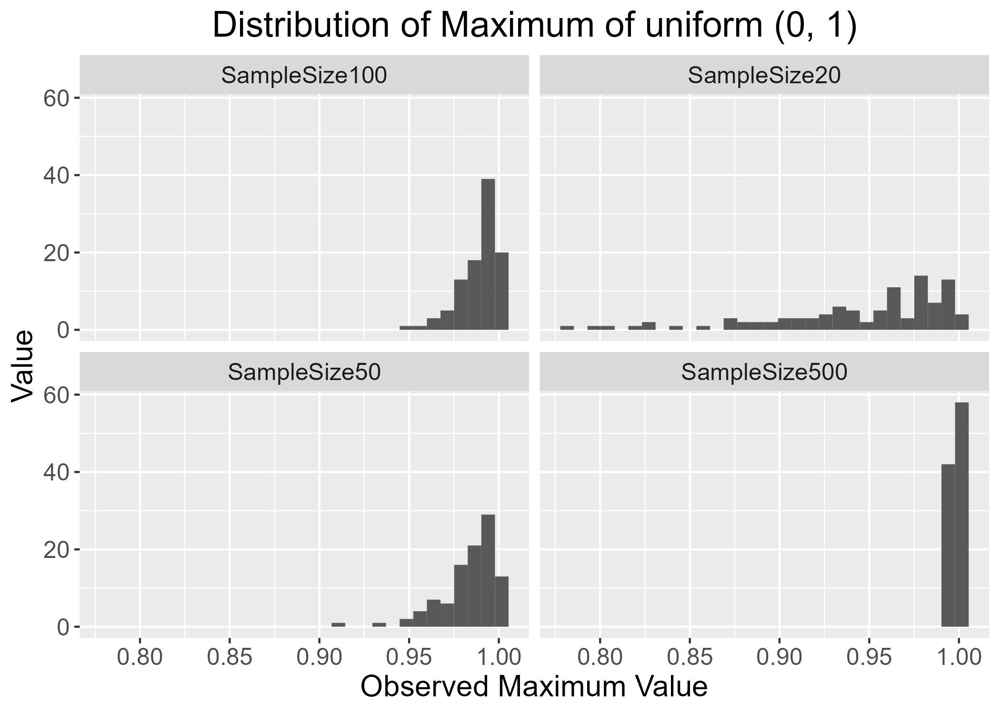
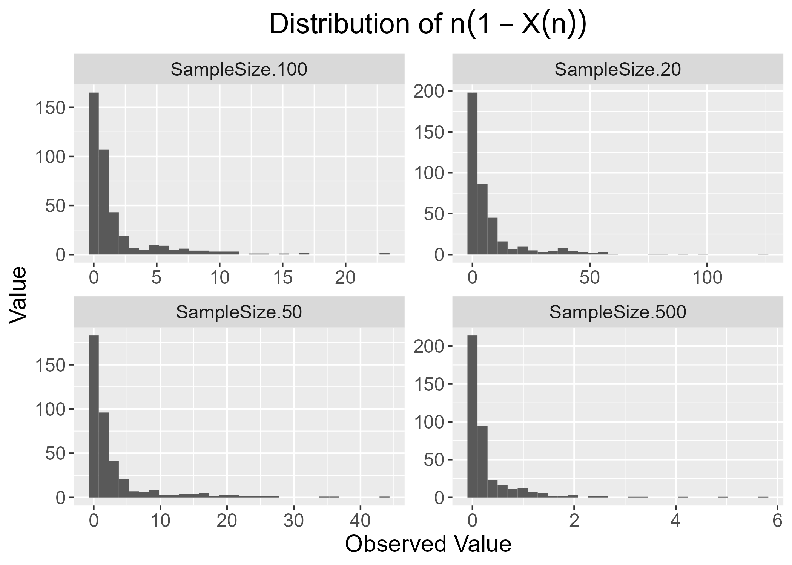

```{js, echo = FALSE}
var coll = document.getElementsByClassName("collapsible");
var i;

for (i = 0; i < coll.length; i++) {
  coll[i].addEventListener("click", function() {
    this.classList.toggle("active");
    var content = this.nextElementSibling;
    if (content.style.display === "block") {
      content.style.display = "none";
    } else {
      content.style.display = "block";
    }
  });
}
```

```{r setup, include=FALSE,warning=FALSE}
knitr::opts_chunk$set(echo = TRUE)
#add library
library(shiny)
library(shinydashboard)
library(ConvergenceConcepts)
library(ggplot2)
library(tidyr)
library(dplyr)
library(kableExtra)
library(plotly)
```


# Motivation

A [Pew Research Center survey of 10,701 U.S. adults was conducted in March 2023](https://www.pewresearch.org/science/2023/05/16/americans-largely-positive-views-of-childhood-vaccines-hold-steady/). The survey asked participants questions related to their thoughts on vaccination. One question centered around the perceived efficacy of the MMR vaccine.

<div style = "float:right">
```{r, echo = FALSE, out.width = "400px"}
knitr::include_graphics("img/pew.jpg")
```
</div>

The Center survey finds 88% of Americans say the benefits of childhood vaccines for measles, mumps and rubella (MMR) outweigh the risks, compared with just 10% who say the risks outweigh the benefits.

The sample proportion of 0.88 is an estimate of the population proportion. That is, the actual proportion of U.S. adults that believe the benefits outweigh the risks. 

Of course this is a single number estimate that would change if we sampled again. We can report the standard deviation of this sample proportion, called a standard error, to give us an idea of the variability in the estimate.  

Assuming independence between study participants, we can find an estimated standard error for this sample proportion using techniques learned eariler:

$$\widehat{SE(\hat{p})} = \sqrt{\frac{\hat{p}(1-\hat{p})}{n}} \approx \sqrt{\frac{0.88*0.12}{10701}} = 0.0031$$
Two big questions arise:

- First, can we provide a range of values we are 'confident' the true proportion falls in?
    + We need to know about more than just the variability of the estimator
    + We need to understand the **distribution** of the estimator!
        - Called the **sampling distribution**
        - Describes the pattern in which we observe this $\hat{p}$
    + The sampling distribution can be difficult to derive in some cases!
- Second, ideally we'd like for our estimator to get closer to the true proportion for larger sample sizes
    + Is there a value that $\hat{p}$ *converges* to as n grows?
    + What does it even mean for a random quantity to converge?
    
These two questions can often be answered by looking at the *limiting* behavior (here as the sample size grows) of the estimator $\hat{p}$.


## Convergence in Distribution Idea

To answer the first question, let's consider determining the sampling distribution through simulation. A distribution just describes the pattern in which we observe our variable. If we can simulate observing the variable, we can create many *realizations* of $\hat{p}$ to understand the sampling distribution. 

To do this we need to make some assumptions. We need to assume a true $p$ and a sample size $n$. Let's use the app below to consider the sampling distribution when $p$ is 0.9 and $n$ is 100.

Instructions:

- "n: sample size" Slider: Move the  slider to the right to increase the sample size
- "p: true value in population" Slider: Move the  slider to the right to increase the true proportion
- "Generate a sample proportion": Click this button to add a single randomly generated sample proportion to the plot
- "Generate 100 sample proportions": Click this button to add 100 randomly generated sample proportions to the plot
- "Add +/- 2 Standard Error and Overlay Smoothed Density" Check this bot to add bars corresponding to two standard errors and also add a smoothed density overlayed

```{r, echo = FALSE}
shinyApp(
  ui <- fluidPage(
    #inputs on the side for n, p, and generating data
    sidebarPanel(
      sliderInput("sample_size",
                  "n: sample size",
                  min = 1,
                  max = 500,
                  step= 1,
                  value = 100),
      sliderInput("true_p",
                  "p: true value in population",
                  min = 0,
                  max = 1,
                  step= 0.01,
                  value = 0.9),
      actionButton("gen",
                   "Generate a sample proportion"),
      actionButton("gen100",
                   "Generate 100 sample proportions"),
      checkboxInput("bars", 
                    "Add +/- 2 Standard Errors and\nOverlay Smoothed Density",
                    value = FALSE)
    ),
    mainPanel(
      plotOutput("samp_dist")
    )
  ),
  server <- function(input, output, session){
      ys <- reactiveValues(y = c(), n = 0)

      observeEvent(input$gen, 
                   {
                     ys$y <- c(ys$y, rbinom(1, size = input$sample_size, prob = input$true_p))
                     ys$n <- ys$n + 1
                     }
                   )
      
      observeEvent(input$gen100, 
                   {
                     ys$y <- c(ys$y, rbinom(100, size = input$sample_size, prob = input$true_p))
                     ys$n <- ys$n + 100
                     }
       )
      
      observeEvent(c(input$sample_size, input$true_p), 
                   {
                     ys$y <- c()
                     ys$n <- 0
                     }
                   )
            
      output$samp_dist <- renderPlot({
        props <- ys$y/input$sample_size
        if(length(props) > 0) {
          hist(props, 
               xlab = "Sample Proportions", 
               main = paste0("Sampling Distribution of p-hat\n# of sample proportions plotted: ", ys$n),
               freq = FALSE)
          if(input$bars){
            se <- sqrt(input$true_p*(1-input$true_p)/input$sample_size)
            bounds <- c(input$true_p - 2*se, input$true_p + 2*se)
            abline(v = bounds, col = "red", lwd = 2)
            
            text(x = input$true_p + 0.5*se, y = 2, labels = paste0(round(mean(props <= bounds[2] & props >= bounds[1]), 2), " of the distribution\nbetween the bars"))
            lines(density(props, kernel = "gaussian", adjust = 2))
          }
        } else {
          NULL
        }
      })
  }
)
```

As long as the distribution is roughly normal, we can see that 0.95 of the distribution falls within two standard errors of $p$. This means we could use something like 

$$\hat{p}\pm 2*\widehat{SE(\hat{p})}$$

as an interval to *capture* the true $p$. (Indeed this is the usual basic interval for a proportion!)


## Convergence in Probability Idea

To answer the second question, we could consider generating sample proportions for ever increasing values of the sample size and seeing how they behave. Below generate sample proportions and subtract off the true value of $p$, plotting those differences. **Add in instructions**

Instructions:

- "Maximum Sample Size": Enter a number to increase/decrease the largest sample size to consider
- "# samples at each n" Slider: Move the slider to select the number of sample proportions to generate at each given sample size
- "p: true value in population": Move this slider to select the true proportion from the population
- "Create/Update graph": Click this button to create the initial graph or update the graph based off of new selections of the above values


```{r, echo = FALSE}
shinyApp(
  ui <- fluidPage(
    #inputs on the side for n, p, and generating data
    sidebarPanel(
      numericInput("max_size",
                   "Maximum Sample Size",
                   value = 250,
                   min = 10, 
                   max = 5000),
      sliderInput("num_samples",
                  "# samples at each n",
                  min = 1,
                  max = 10,
                  step= 1,
                  value = 1),
      sliderInput("true_p",
                  "p: true value in population",
                  min = 0,
                  max = 1,
                  step= 0.01,
                  value = 0.5),
      actionButton("create",
                   "Create/Update graph")
    ),
    mainPanel(
      plotOutput("convergence")
    )
  ),
  server <- function(input, output, session){
      ps <- reactiveValues(p = c())

      observeEvent(input$create, 
                   {
                     ps$p <- sapply(1:input$max_size, FUN = function(x){
                       rbinom(n = input$num_samples, 
                              size = x,
                              prob = input$true_p)/x
                       })
                     }
                   )
            
      output$convergence <- renderPlot({
        props <- ps$p
        truth <- isolate(input$true_p)
        num <- isolate(input$num_samples)
        max_size <- isolate(input$max_size)
        ep <- 0.05
        if(length(props) == 0) {
          plot(x = NULL, 
               y = NULL, 
               xlim = c(0, max_size), 
               ylim = c(-0.5, 0.5),
               xlab = "Sample Size",
               ylab = "phat-p",
               main = "Plot of sample proportion minus the true proportion\nRed lines indicate +/- 0.05")
          abline(h = c(-ep, ep), col = "red", lwd = 2)
        } else {
          plot(x = rep(1:max_size, each = num), y = c(props)-truth, 
               main = "Plot of sample proportion minus the true proportion\nRed lines indicate +/- 0.05",
               xlab = "Sample Size",
               ylab = "phat - p",
               type = "p")
          abline(h = c(-ep, ep), col = "red", lwd = 2)
        }
      })
  }
)
```

We can see that $\hat{p}-p$ seems to get closer to 0. This indicates that $\hat{p}$ is in some sense *converging* to the true value of $p$!

Now that we some basic intuition, let's formalize what we are talking about.

# What is Limit Theory?

By limit, large-sample, or asymptotic theory we mean we want to understand the behavior of some quantity, usually a statistic, as something changes, usually the sample size $n$. For instance, we will investigate the behavior of the sample mean, $\bar{Y}$, as the sample size grows. We'll look at questions like:

- When the distribution of a statistic (called a **sampling distribution**) is difficult to derive *exactly*, is there a good **approximating** distribution that can be used to get **approximate** probability statements about $\bar{Y}$?
- What value does $\bar{Y}$ *get close to* or *converge* to as the sample size grows? 

Answers to these questions will allows us to do inference (confidence intervals and hypothesis tests) and understand how well we are estimating a quantity, respectively.

## Common Assumptions & Definitions

We must make some assumptions about how we observe our random variables in order to investigate these types of questions. For simplicity, we often assume we have a **random sample**.

Random Sample
: $Y_1,..., Y_n$ are a random sample (RS) of size $n$ if the random variables are independent and identically distributed (iid). 

We'll often say 'assume we have a random sample' from some distribution or that 'our random variables are iid' from some distribution. These are equivalent ways of stating this assumption.

For the proportion example above we might formally state our assumption as follows:

- Define $X_i = \begin{cases} 1 & \mbox{if the }i^{th}\mbox{ individual says the benefits of childhood vaccines for MMR outweigh the risks}\\ 0 & \mbox{if not}\end{cases}$
- Then $X_i\stackrel{iid}\sim Ber(p)$ where $p$ represents the true proportion of people in the U.S. that believe the benefits outweight the risks
- The random variable $Y = \sum_{i=1}^{n}X_i \sim Bin(n,p)$
- We then often try to use $Y$ or $\hat{p}=Y/n$ to make inference on $p$. $Y$ and $\hat{p}$ are referred to as **statistics**. Note: $\hat{p}$ is also $\bar{X}$!

Statistic
: A function of $Y_1,Y_2,...,Y_n$ from a random sample that does not involve any unknown parameters is called a statistic.

Commonly studied statistics:  

- $\bar{Y} = \frac{1}{n}\sum_{i=1}^n Y_i$
- $S^2 = \frac{1}{n-1}\sum_{i=1}^{n}(Y_i-\bar{Y})^2$
- $Y_{(n)} = \mbox{the maximum value from the sample}$

Quantities that aren't statistics:  

- $\frac{\bar{Y}-\mu}{S/\sqrt{n}}$ (since $\mu$ is unknown - if we assume $\mu$ is known (like when we do a test statistic) then this is a statistic)
- $\frac{(n-1)S^2}{\sigma^2}$ (since $\sigma^2$ is unknown)

One type of convergence we'll look at is focused on the pattern in which these statistics are observed, that is, the **sampling distribution** of the statistics.

Recall that a distribution is just the pattern and frequency with which we observe a random variable. With a statistic, we give this distribution the special name of sampling distribution. This is because we can think of how that distribution is formed by considering repeated samples from the population, each sample producing the statistic of interest.

Sampling Distribution
: The distribution of a statistic is called a sampling distribution.

**Put a gif of a sampling distribution being built by adding values using the binomial p-hat example. Sample size of n = 40 with p = 0.25 or something like that. Very skinny bars so they can see the discrete nature with a normal distribution overlay. The gif should add say 500 values of p-hat over 5 seconds or so.**

**I've put the code you used for a gif here below. I would not have the code evaluate at run time but produce an output .gif with the anim_save() you had. Then just load that gif in. I've streamlined your code for the gamma example below. This code won't work for what goes here but perhaps can be used later!**

```{r, echo=FALSE, message=FALSE, eval = FALSE}
library(dplyr)
library(ggplot2)
library(gganimate)
#################################################################################
#gamma
# alpha=5
# lambda=1
# M <- 100 
# 
# #quicker way than for loop for this
# n20 <- replicate(M, mean(rgamma(n = 20, shape = alpha, scale = lambda)))
# n50 <- replicate(M, mean(rgamma(n = 50, shape = alpha, scale = lambda)))
# n100 <- replicate(M, mean(rgamma(n = 100, shape = alpha, scale = lambda)))
# n500 <- replicate(M, mean(rgamma(n = 500, shape = alpha, scale = lambda)))
# 
# #even better way to do this for many n values 
# ns <- 2:10
# means <- as.data.frame(
#   lapply(ns, 
#          FUN = function(x, M, alpha, lambda){replicate(M, mean(rgamma(n = x, shape = alpha, scale = lambda)))}, 
#          M = M, alpha = alpha, lambda = lambda), 
#   col.names = paste0("n",ns))
# 
# means_long <- pivot_longer(means, cols = everything(), names_to = "n", values_to = "means")
# # create ggplot2 plot
# ggplot(means_long) + 
#   geom_histogram(aes(x = means, group=n),bins=50,col="red",fill="red") +  theme(text = element_text(size = 15))+theme(plot.title = element_text(hjust = 0.5),plot.subtitle=element_text(hjust=0.5))+
#   ggtitle("Distribution of Observed Mean values") +
#   labs(subtitle=("Sample Size : {closest_state}")) +
#   ylab("Absolute Frequency out of 1000") + 
#   xlab("Observed Mean Value ") + 
#   transition_states(n)
#anim_save("gammean.gif")
##################################################################################################
#binormial proportion

p=0.25
nn=40
M <- 100
# 
# #quicker way than for loop for this
# n20 <- replicate(M, mean(rbinom(n = 20, nn, p)))
# n50 <- replicate(M, mean(rbinom(n = 50, nn, p)))
# n100 <- replicate(M, mean(rbinom(n = 100, nn, p)))
# n500 <- replicate(M, mean(rbinom(n = 500, nn, p)))
# 
# #even better way to do this for many n values 
ns <- c(20,50,100,500)
meansp <- as.data.frame(
  lapply(ns,
         FUN = function(x, M, nn, p){replicate(M, mean(rbinom(n = x, nn, p))/nn)},
         M = M, nn, p),
  col.names = paste0("SampleSize",ns))
#
 meansp_long <- pivot_longer(meansp, cols = everything(), names_to = "n", values_to = "means")
# # create ggplot2 plot
animated_plot=ggplot(meansp_long) +
  geom_histogram(aes(x = means, group=n),bins=50,col="red",fill="red") +  theme(text = element_text(size = 15))+theme(plot.title = element_text(hjust = 0.5),plot.subtitle=element_text(hjust=0.5))+
  ggtitle("Distribution of Observed Mean Proportion") +
  labs(subtitle=(" {closest_state}")) +
  ylab(paste0("Absolute Frequency out of ", M)) +
  xlab(paste0("Observed Mean Proportion for b","(",nn,",",p,")"))+transition_states(n)
animation = animate(animated_plot)
anim_save( filename="binormmean.gif")

```


# Convergence in Distribution 

We saw that the distribution of $\hat{p}$ seemed to look like a bell curve for some combinations of $n$ and $p$. If we fix a $p$ and increase $n$, we will start to see a bell shape for large enough $n$! Later we'll see that a good **large-sample** distribution for $\hat{p}$ is the Normal distribution with mean $p$ and variance $p(1-p)/n$.  

We can see that there may be a distinction between the *actual* distribution, which is a discrete distribution for $\hat{p}$, and an approximating distribution, the Normal distribution for $\hat{p}$. We call these by different names.

Exact Distribution
: The (sampling) distribution of a quantity that is valid for any sample size (or, occasionally, values of the parameters of the population distribution).

Large-Sample or Approximate Distribution
: A (sampling) distribution that is reasonable to use for a quantity for a *large* sample size (or occasionally other parameter values). 

We use the notation
$$Statistic \stackrel{\bullet}\sim f$$
to denote a large-sample approximating distribution.

In the sample proportion example, we would write

$$\hat{p}\stackrel{\bullet}\sim N(p, p(1-p)/n)$$

While this idea can be visually inspected with a histogram, formally we define **convergence in distribution** using the cumulative distribution function or CDF.

Let's formally define convergence in distribution! Recall the Cumulative Distribution Function (or CDF) of a random variable $Y$ is defined as 

$$F_Y(y) = P(Y\leq y)$$

<div style = "float:left">
```{r, echo = FALSE, message = FALSE, out.width = "400px"}
p <- 0.05
n <- 20
plot_seq <- seq(from = -0.21, to = 8, by = 0.01)
NN <- length(plot_seq)
bin_cdf <- pbinom(plot_seq, size = n, prob = p)
norm_cdf <- pnorm(plot_seq, mean = n*p, sd = sqrt(n*p*(1-p)))

ecdf <- data.frame(
  y = c(bin_cdf, norm_cdf),
  CDF = c(rep(paste0("Bin(", n, ", ", p, ")"), NN), rep(paste0("N(", n*p, ", ", round(n*p*(1-p), 2), ")"), NN)),
  x = c(plot_seq, plot_seq)
)

ggplot(ecdf, aes(x = x, y = y, color = CDF)) + 
  geom_line(stat = "identity") +
  theme(text = element_text(size = 15), 
        plot.title = element_text(hjust = 0.5), 
        legend.text = element_text(size=15), 
        legend.position = c(0.8, 0.15)) +
  ggtitle("Emprical CDF vs Normal") +
  ylab("Cumulative Distribution Function") + 
  xlab("Observed Value")
```
</div>
<div style = "float:right">
```{r, echo = FALSE, message = FALSE,out.width = "400px"}
p <- 0.35
n <- 30
plot_seq <- seq(from = -0.21, to = 22, by = 0.01)
NN <- length(plot_seq)
bin_cdf <- pbinom(plot_seq, size = n, prob = p)
norm_cdf <- pnorm(plot_seq, mean = n*p, sd = sqrt(n*p*(1-p)))

ecdf <- data.frame(
  y = c(bin_cdf, norm_cdf),
  CDF = c(rep(paste0("Bin(", n, ", ", p, ")"), NN), rep(paste0("N(", n*p, ", ", round(n*p*(1-p), 2), ")"), NN)),
  x = c(plot_seq, plot_seq)
)

ggplot(ecdf, aes(x = x, y = y, color = CDF)) + 
  geom_line(stat = "identity") +
  theme(text = element_text(size = 15), 
        plot.title = element_text(hjust = 0.5), 
        legend.text = element_text(size=15), 
        legend.position = c(0.8, 0.15)) +
  ggtitle("Emprical CDF vs Normal") +
  ylab("Cumulative Distribution Function") + 
  xlab("Observed Value")
```
</div>

<div class = "clearfix"></div>

Convergence in Distribution
: The quantity $Y_n$ converges in distribution to $Y$ if
$$\lim_{n \rightarrow \infty} F_{Y_n}(y)=F_{Y}(y)$$
or equivalently
$$\lim_{n \rightarrow \infty} |F_{Y_n}(y)-F_{Y}(y)|=0$$
(at all points $y$ where $F_Y(y)$ is continuous). We denote this as
$$Y_n\stackrel{d}\rightarrow Y$$

For example, given a random sample from a distribution with finite variance, 
$$Z_n = \frac{\bar{Y}_n - \mu}{\sigma/\sqrt{n}}$$
can be shown to converge in distribution to a standard normal distribution. This means that
$$\lim_{n \rightarrow \infty} F_{Z_n}(z)=F_{Z}(z)$$
where $Z\sim N(0,1)$.

Note: Here the subscript $n$ is just to explicitly note the dependence of the quantity on the sample size. We could leave that off if we'd like.

## Convergence in Distribution Example

- Suppose that $Y_i\stackrel{iid}\sim U(0,1)$. That is,
$$f_Y(y) = \begin{cases}1 & 0<y<1\\0 & otherwise\end{cases}$$
and
$$F_Y(y) = \begin{cases} 0 & y < 0\\ y & 0\leq y < 1 \\ 1 & y\geq 1\end{cases}$$
- What does the maximum from the sample converge to in distribution as $n$ grows?
    + Recall the PDF of the maximum, $Y_{(n)}$ from a random sample is given by 
    $$F_{Y_{(n)}}(y) = nf_Y(y)\left[F_Y(y)\right]^{n-1}$$ 
    for $y$ in the range of the original PDF.
    
**Put in static graphs of histograms of realizations for increasing sample sizes.**
```{r,  echo = FALSE, message = FALSE}
library(tidyr)
M <- 100
#even better way to do this for many n values
ns <- c(20,50,100,500)
maxu <- as.data.frame(
  lapply(ns,
         FUN = function(x, M){replicate(M, max(runif(n = x, 0, 1)))},
         M = M),
         col.names = paste0("SampleSize",ns)
                     )
maxu_long <- pivot_longer(maxu, cols = everything(), names_to = "n", values_to = "maximum")
maxuplot<-ggplot(maxu_long, aes(x=maximum)) +
        geom_histogram()+
        facet_wrap( ~ n,ncol = 2)+
        theme(text = element_text(size = 15),
        plot.title = element_text(hjust = 0.5),
        legend.text = element_text(size=15),
        legend.position = c(0.1, 0.85)) +
        ggtitle("Distribution of Maximum of uniform (0, 1)") +
        ylab("Value") +
        xlab("Observed Maximum Value")
ggsave("maxuplot.png")

```


```{r, echo = FALSE}

```

**Discuss the ECDF from a sample as an approximation to the CDF.**

**Show CDF comparison plot with a RV that is a point mass at 1. Discuss what we look for.**
<div class = "clearfix"></div>
```{r, message=FALSE,echo=FALSE}

MMM=100
plot_sequ <- seq(from = 0.99, to = 1, length=MMM)
tmpm=c(replicate(MMM, max(runif(n = 500, 0, 1))))
u500_cdfm <- ecdf(tmpm)(plot_sequ)


p_cdfum <-rep(1,MMM)

ecdfm <- data.frame(
  y = c(u500_cdfm, p_cdfum),
  CDF = c(rep("ECDF of X(n)", MMM), rep("R.V. Point Mass 1", MMM)),
  x = c(plot_sequ, rep(1,MMM))
)

ggplot(ecdfm, aes(x = x, y = y, color = CDF)) + 
  geom_line(stat = "identity") +
  theme(text = element_text(size = 15), 
        plot.title = element_text(hjust = 0.5), 
        legend.text = element_text(size=8), 
        legend.position = c(0.85, 0.1)) +
  ggtitle("Emprical CDF vs R.V. with Point Mass 1") +
  ylab("Cumulative Distribution Function") + 
  xlab("Observed Value")
```

**Introduce the 3D plot and what we look for.**
**Prove the result.**

Let $X_1,X_2,..$ .are iid uniform(0,1) and $X(n)=max_{1≤i≤n}X_i$.

As $n\rightarrow \infty$, $\forall \epsilon >0$, 

$P(|Xn−1|≥ϵ)=P(X(n)≤1−ϵ) =P(Xi≤1−ϵ,i=1,...,n)=(1−ϵ)^n$, 


- For the same situation, what does $W = n(1-Y_{(n)})$ converge in distribution to as $n$ grows? Can we describe a rule of thumb for when the approximating distribution is reasonable?

**Put in static graphs of histograms of realizations for increasing sample sizes.**
```{r,message=FALSE,echo=FALSE}
#W = n(1-Y_{(n)})
library(tidyr)
M <- 100
#even better way to do this for many n values
ns <- c(20,50,100,500)
nmaxu <- as.data.frame(
  lapply(ns,
         FUN = function(x, M){replicate(M, ns*(1-max(runif(n = x, 0, 1))))},
         M = M),
  col.names = paste0("SampleSize ",ns)
                      )
nmaxu_long <- pivot_longer(nmaxu, cols = everything(), names_to = "n", values_to = "maximum")
nmaxu_long$n=sub(".[^.]+$", "", nmaxu_long$n)
nmaxuplot<-ggplot(nmaxu_long, aes(x=maximum)) +
        geom_histogram()+
        facet_wrap( ~ n,ncol = 2,scales = "free")+
        theme(text = element_text(size = 15),
        plot.title = element_text(hjust = 0.5),
        legend.text = element_text(size=15),
        legend.position = c(0.1, 0.85)) +
        ggtitle(expression(paste("Distribution of ",n(1-X(n))))) +
        ylab("Value") +
        xlab("Observed Value")
ggsave("nmaxuplot.png")

```


```{r, echo = FALSE}

```
**Discuss the ECDF from a sample as an approximation to the CDF.**
**Show CDF comparison plot with a RV that is a point mass at 1. Discuss what we look for.**
<div class = "clearfix"></div>
```{r, message=FALSE,echo=FALSE}
MM=1000
plot_sequ <- seq(from = -0.5, to = 5, length=MM)
lambda=1
tmp=c(replicate(MM, 500*(1-max(runif(n = 500, 0, 1)))))
u500_cdf <- ecdf(tmp)(plot_sequ)
exp_cdfu <- pexp(plot_sequ,lambda )

ecdfu <- data.frame(
  y = c(u500_cdf, exp_cdfu),
  CDF = c(rep("ECDF of n(1-X(n))", MM), rep("exp(1)", MM)),
  x = c(plot_sequ, plot_sequ)
)

ggplot(ecdfu, aes(x = x, y = y, color = CDF)) + 
  geom_line(stat = "identity") +
  theme(text = element_text(size = 15), 
        plot.title = element_text(hjust = 0.5), 
        legend.text = element_text(size=15), 
        legend.position = c(0.8, 0.15)) +
  ggtitle("Emprical CDF vs Exponential") +
  ylab("Cumulative Distribution Function") + 
  xlab("Observed Value")
```

**Introduce the 3D plot and what we look for.**
**Prove the result.**

From above, let $\epsilon= \frac{t}{n}$, 

then $P(X(n)≤1−\frac{t}{n})=(1−\frac{t}{n})^n \rightarrow e^{−t}$. 

$P(n(1−X(n))≤t) \rightarrow 1−e^{−t}$, the random variable $n (1−X(n))$ converges to exponential(1).


## Convergence Exploration

- Suppose that $Y_i\stackrel{iid}\sim Gamma(\alpha, \lambda)$. That is, assume we have a random sample from a Gamma distribution with PDF
$$f_Y(y) = \frac{\lambda^\alpha}{\Gamma(\alpha)}y^{\alpha -1}e^{-\lambda y}$$
with mean $E(Y) = \alpha/\lambda$ and variance $Var(Y) = \alpha/\lambda^2$.
- Consider the statistic $\bar{Y} = \frac{1}{n}\sum_{i=1}^n Y_i$. 
- The sampling distribution of this statistic can often be well approximated using a Normal distribution. Consider changes to $\alpha$, $\lambda$, and $n$ using the app below. 
- Can you develop a rule of thumb around $\alpha$, $\lambda$, and $n$ for when a Normal distribution may be a reasonable approximation?  Remember we look for the following in each graph:  
    + Histogram: when does it become a symmetric bell-shape?
    + CDF comparison: When do the CDFs essentially overlap? (**Note: We know the result here and are using that here or something clearer than that**)
    + Absolute difference in CDFs: When do the differences get small?

```{r, echo=FALSE}
shinyApp(
  ui <- fluidPage(
    sidebarLayout(
      sidebarPanel( 
        sliderInput("d_ngam",
                    "n: sample size",
                    min = 2,
                    max = 100,
                    step = 1,
                    value = 20,
                    animate=animationOptions(
                      interval = 100,
                      loop = TRUE,
                      playButton = "Play",
                      pauseButton = "Stop")
                    ),
        sliderInput("alpha",
                    "alpha: shape parameter",
                    min = 0.05,
                    max = 5,
                    step = 0.05,
                    value = 1,
                    animate=animationOptions(
                      interval = 100,
                      loop = TRUE,
                      playButton = "Play",
                      pauseButton = "Stop")
                    ) ,
        sliderInput("lambda",
                    "lambda: scale parameter",
                    min = 0.05,
                    max = 5,
                    step= 0.05,
                    value = 1,
                    animate=animationOptions(
                      interval = 100,
                      loop = TRUE,
                      playButton = "Play",
                      pauseButton = "Stop")
                    )
      ),

      mainPanel(
        tabsetPanel(id = "gamma_example",
          tabPanel("Histogram",
                   plotOutput("hist")
                   ),
          tabPanel("CDF Plots",
                   plotOutput("cdf")
                   ),
          tabPanel("Absolute Difference in ECDF with Normal",  
                   actionButton("three_d_plot", "Create/Update 3D Plot"),
                   plotOutput("three_d")
                   )
        )
      )
    )
  ),
  server <- function(input, output, session){
    
    sampled_values <- reactiveValues(gamma_means = c())
    observeEvent(c(input$d_ngam, input$alpha, input$lambda),
                 sampled_values$gamma_means <- replicate(1000, mean(rgamma(n = input$d_ngam, shape = input$alpha, rate = input$lambda)))
                 )
    
    output$hist <- renderPlot({
      d_ngam <- isolate(input$d_ngam)
      data_gamma <- sampled_values$gamma_means
      hist(data_gamma, 
           main = paste0("Distribution of 1000 Observed Sample Means\nWith Sample Size n = ", d_ngam),
           xlab = "Observed Sample Mean",
           freq = FALSE)
          })
    
    output$cdf <- renderPlot({
      d_ngam <- isolate(input$d_ngam)
      d_alpha <- isolate(input$alpha)
      d_lambda <- isolate(input$lambda)
      data_gamma <- sampled_values$gamma_means
      #plot the ecdf of the sample means
      plot(ecdf(data_gamma), 
           main = paste0("Comparison of Empirical CDF to Best\nApproximating Normal CDF with Sample Size n = ", d_ngam),
           col = "red", 
           lwd = 2,
           xlab = "y-bar",
           ylab = "CDF")
      #use theoretical normal here
      gam_mean <- d_alpha/d_lambda
      gam_sd <- sqrt(d_alpha/(d_ngam*d_lambda^2))
      x_plot <- seq(from = gam_mean-3*gam_sd, to = gam_mean+3*gam_sd, length = 500)
      #add the normal's cdf values
      lines(x = x_plot, 
            y = pnorm(x_plot, mean = gam_mean, sd = gam_sd),
            col = "blue", 
            lwd = 2)
      #add legend
      legend('topleft', 
             c(expression(hat(F[bar(Y)](y))),expression(F[X](y))),
             col = c("red", "blue"),
             lwd= 2)
      })

    three_d_plot_values <- reactiveValues(plot_data = c())
    #create data for 3d plot
    observeEvent(input$three_d_plot, {
        d_ngam <- input$d_ngam
        d_alpha <- input$alpha
        d_lambda <- input$lambda
        ns <- 2:d_ngam
        #find means for each sample size
        means <- as.data.frame(
          #to every sample size value 2:n create 100 means of size n
          lapply(ns, 
                 FUN = function(x, d_alpha, d_lambda){replicate(1000, mean(rgamma(n = x, shape = d_alpha, rate = d_lambda)))}, d_alpha = d_alpha, d_lambda = d_lambda), 
          col.names = paste0("n",ns))
        #now find the ecdf for each sample size (each column)
        ecdfs <- apply(X = means, MARGIN = 2, FUN = ecdf)
        #gamma mean and sd
        gam_mean <- d_alpha/d_lambda
        gam_sd <- sqrt(d_alpha/(d_lambda^2*2))
        #create a sequence of ybars to evaluate the ecdf at
        ybars <- seq(from = gam_mean-3*gam_sd, to = gam_mean+3*gam_sd, length = 50)
        #find the corresponding normal distribution's cdf values
        zs <- as.data.frame(
          lapply(ns,
                 FUN = function(x, ybars, d_alpha, d_lambda){
                   pnorm(ybars, 
                         mean = gam_mean, 
                         sd = sqrt(d_alpha/(d_lambda^2*x)))
                   }, ybars = ybars, d_alpha = d_alpha, d_lambda = d_lambda),
          col.names = paste0("n", ns)
        )
        diffs <- lapply(X = 1:length(ecdfs), FUN = function(x) abs(ecdfs[[x]](ybars) - zs[,x]))
        #now we have the ns, ybars, and diffs to plot
        plot_data <- expand.grid(ybars = ybars, ns = ns)
        plot_data$diffs <- unlist(diffs) 
        three_d_plot_values$plot_data <- plot_data
    })
    
    output$three_d <- renderPlot({
        plot_data <- three_d_plot_values$plot_data
        # open3d()
        # plot3d(x = plot_data$ybars, y = plot_data$ns, z = plot_data$diffs)
        # scene <- scene3d()
        # close3d()
        # rglwidget(scene)
        if(length(plot_data)>0){
          print(wireframe(diffs ~ ybars + ns, 
                          data = plot_data, 
                          scales = list(arrows = FALSE), 
                          drape = TRUE, 
                          colorkey = TRUE, 
                          screen = list(z = -50, x = -70), 
                          zlab = list(expression(hat(l)[n] ~ "(x)=|" ~ hat(F)[n] ~ "(x)-" ~ F ~ "(x)|"), rot = 90), 
                          main = "Convergence in Distribution?", 
                          xlab="ybar"))
        } else {
          NULL
        }
    })
  })
```

## Central Limit Theorem

One of the most important theorems in statistics is the Central Limit Theorem (CLT). The CLT gives us a general result about the large-sample behavior of a sample mean.

CLT
: Suppose that $Y_i\stackrel{iid}\sim f_Y$ where $E(Y)=\mu$ and $Var(Y)=\sigma^2 < \infty$.  Define $\bar{Y}=\frac{1}{n} \sum_{i=1}^{n} Y_i$ and $Z \sim N(0, 1)$
$$\frac{\bar{Y}-\mu}{\sigma/\sqrt{n}} \stackrel {d} {\rightarrow} Z$$

Practically, we can say that a good approximating distribution or large-sample distribution for $\bar{Y}$ is
$$\bar{Y}\stackrel{\bullet}\sim N(\mu, \sigma^2/n)$$

## CLT Applied to the Gamma Example

**Apply to the gamma distribution example**

For example, if $Y_i\stackrel{iid}\sim Gamma(\alpha, \lambda)$ with mean $E(Y) = \alpha/\lambda$ and variance $Var(Y) = \alpha/\lambda^2$.

Then $\bar{Y}$ is
$$\bar{Y}\stackrel{\bullet}\sim N(\alpha/\lambda, \alpha/\lambda^2n)$$


## CLT Applied to a Sample Proportion

A common application of the CLT is to the sample proportion from a Binomial experiment.

**Apply CLT to the sample proportion**

For example, if $Y_i\stackrel{iid}\sim Bin(n, p)$ with mean $E(Y) = np$ and variance $Var(Y) = np(1-p)$. 

Then $X=\frac{Y}{n}$ has mean $E(X) = p$ and variance $Var(X) = p(1-p)/n$

So ${X}$ is
$${X}\stackrel{\bullet}\sim N(p, p(1-p)/n)$$

**Now let them explore the CLT on a sample proportion with app. Ask for rules of thumb or if they know rules of thumb, to justify them.**

```{r, echo=FALSE}
shinyApp(
  ui <- fluidPage(
    sidebarLayout(
      sidebarPanel( 
        sliderInput("d_nprop",
                    "n: sample size",
                    min = 5,
                    max = 100,
                    step = 1,
                    value = 20,
                    animate=animationOptions(
                      interval = 100,
                      loop = TRUE,
                      playButton = "Play",
                      pauseButton = "Stop")
                    ),
        sliderInput("prop",
                    "p: probability of success",
                    min = 0.1,
                    max = 1,
                    step = 0.05,
                    value = 0.1,
                    animate=animationOptions(
                      interval = 1,
                      loop = TRUE,
                      playButton = "Play",
                      pauseButton = "Stop")
                    ) ,
        sliderInput("M",
                    "M: the number of the simulations",
                    min = 50,
                    max = 1000,
                    step= 50,
                    value = 50,
                    animate=animationOptions(
                      interval = 1000,
                      loop = TRUE,
                      playButton = "Play",
                      pauseButton = "Stop")
                    )
      ),

      mainPanel(
        tabsetPanel(id = "proportion_example",
          tabPanel("Histogram",
                   plotOutput("hist")
                   ),
          tabPanel("CDF Plots",
                   plotOutput("cdf")
                   ),
          tabPanel("Absolute Difference in ECDF with Normal",  
                   actionButton("three_d_plot", "Create/Update 3D Plot"),
                   plotOutput("three_d")
                   )
        )
      )
    )
  ),
  server <- function(input, output, session){
    
    sampled_values <- reactiveValues(sample_prop = c())
    observeEvent(c(input$d_nprop, input$prop, input$M),
                 sampled_values$sample_prop <- replicate(input$M, (rbinom(input$M,input$d_nprop, input$prop))/input$d_nprop)
                 )
    
    output$hist <- renderPlot({
      d_nprop <- isolate(input$d_nprop)
      data_prop <- sampled_values$sample_prop
      hist(data_prop, 
           main = paste0("Distribution of ",input$M," Observed Sample proportionss\nWith n = ", d_nprop),
           xlab = "Observed Sample Proportion",
           freq = FALSE)
          })
    
    output$cdf <- renderPlot({
      d_nprop <- isolate(input$d_nprop)
      prop <- isolate(input$prop)
      M <- isolate(input$M)
      data_prop <- sampled_values$sample_prop
      #plot the ecdf of the sample means
      plot(ecdf(data_prop), 
           main = paste0("Comparison of Empirical CDF to Best\nApproximating Normal CDF with Sample Size n = ", d_nprop),
           col = "red", 
           lwd = 2,
           xlab = "y/n",
           ylab = "CDF")
      #use theoretical normal here
      prop_mean <- prop
      prop_sd <- sqrt(prop*(1-prop)/d_nprop)
      x_plot <- seq(from = prop_mean-3*prop_sd, to = prop_mean+3*prop_sd, length = 500)
      #add the normal's cdf values
      lines(x = x_plot, 
            y = pnorm(x_plot, mean = prop_mean, sd = prop_sd),
            col = "blue", 
            lwd = 2)
      #add legend
      legend('topleft', 
             c(expression(hat(F[y/n](y))),expression(F[X](y))),
             col = c("red", "blue"),
             lwd= 2)
      })

    three_d_plot_values <- reactiveValues(plot_data = c())
    #create data for 3d plot
    observeEvent(input$three_d_plot, {
        d_nprop <- input$d_nprop
        prop <- input$prop
        M <- input$M
        ns <- 2:d_nprop
        #find means for each sample size
        props <- as.data.frame(
          #to every sample size value 2:n create 100 means of size n
          lapply(ns, 
                 FUN = function(x, M, prop){replicate(M, (rbinom(M, x, prop))/x)}, prop, M), 
          col.names = paste0("n",ns))
        #now find the ecdf for each sample size (each column)
        ecdfs <- apply(X = props, MARGIN = 2, FUN = ecdf)
        #gamma mean and sd
        prop_mean <- prop
        prop_sd <- sqrt(prop*(1-prop)/d_nprop)
        #create a sequence of ybars to evaluate the ecdf at
        ybars <- seq(from = prop_mean-3*prop_sd, to = prop_mean+3*prop_sd, length = 50)
        #find the corresponding normal distribution's cdf values
        zs <- as.data.frame(
          lapply(ns,
                 FUN = function(x, ybars, M,prop){
                   pnorm(ybars, 
                         mean = prop_mean, 
                         sd =  sqrt(prop*(1-prop)/d_nprop))
                   }, ybars = ybars,  M,prop),
          col.names = paste0("n", ns)
        )
        diffs <- lapply(X = 1:length(ecdfs), FUN = function(x) abs(ecdfs[[x]](ybars) - zs[,x]))
        #now we have the ns, ybars, and diffs to plot
        plot_data <- expand.grid(ybars = ybars, ns = ns)
        plot_data$diffs <- unlist(diffs) 
        three_d_plot_values$plot_data <- plot_data
    })
    
    output$three_d <- renderPlot({
        plot_data <- three_d_plot_values$plot_data
        # open3d()
        # plot3d(x = plot_data$ybars, y = plot_data$ns, z = plot_data$diffs)
        # scene <- scene3d()
        # close3d()
        # rglwidget(scene)
        if(length(plot_data)>0){
          print(wireframe(diffs ~ ybars + ns, 
                          data = plot_data, 
                          scales = list(arrows = FALSE), 
                          drape = TRUE, 
                          colorkey = TRUE, 
                          screen = list(z = -50, x = -70), 
                          zlab = list(expression(hat(l)[n] ~ "(x)=|" ~ hat(F)[n] ~ "(x)-" ~ F ~ "(x)|"), rot = 90), 
                          main = "Convergence in Distribution?", 
                          xlab="y/n"))
        } else {
          NULL
        }
    })
  })
```

## CLT Applied to a Sum 

Recall the result: 

- If $X\sim N(\mu, \sigma^2)$ then $aX+b\sim N(a\mu+b,a^2\sigma^2)$
- A Normal random variable multiplied by a constant is still Normally distributed, just with a different mean and variance. 
- This implies we can find a good large-sample distribution for a summation when the CLT is applicable!

Under the same assumptions as the CLT, since $n\bar{Y} = \sum_{i=1}^{n}Y_i$ we have the following result:
$$\sum_{i=1}^{n} Y_i \stackrel{\bullet}{\sim}N(n\mu, n\sigma^2)$$

**Apply CLT to sum of iid gammas. Show how it can be used to show convergence of a gamma to a normal as $\alpha$ grows**

## Example CLT on a Sum Applied to the Binomial

**Quick exercise, apply CLT on sum to binomial**

Practically, why is the CLT so important?

- Suppose we know $\sigma$ and we want inference for $\mu$.
- If we get a RS $Y_1,...,Y_n$ we know  $\bar{Y}\stackrel{\bullet}{\sim}N(\mu,\sigma^2/n)$ ($\mu$ only unknown)
- We can make an approximate claim about $\mu$ via a confidence interval
$$P(-1.96<Z<1.96)=0.95 \Leftrightarrow 
	P\left(-1.96<\frac{\bar{Y}-\mu}{\sigma/\sqrt{n}}<1.96\right)=0.95$$
$$\Leftrightarrow P\left(\bar{Y}-1.96\sigma/\sqrt{n}<\mu<\bar{Y}+1.96\sigma/\sqrt{n}\right)=0.95$$
- That is, there is a 95\% probability the RVs 
$\bar{Y}-1.96\sigma/\sqrt{n}$ and $\bar{Y}+1.96\sigma/\sqrt{n}$ capture $\mu$.
- Observe $\bar{Y}=\bar{y}$, get observed CI.  Range we are `confident' contains $\mu$.
- Note: No assumption about $Y$'s distribution made other than finite variance!


# Convergence in Probability Definition 

We saw that the estimator of $p$, $\hat{p}$, from the Binomial example seemed to be observed closer and closer to $p$ for larger sample sizes. Additionally, we saw a good large-sample distribution for $\hat{p}$ is
$$\hat{p}\stackrel{\bullet}\sim N\left(p, \frac{p(1-p)}{n}\right)$$
As $n$ grows we can see that this distribution concentrates more and more around $p$. 

This is the idea of **convergence in probability to a constant** - the probability our random variable is observed 'close' to that value goes to 1. Let's formally define this idea!

Convergence in Probability
: A sequence of RVs $Y_1,...,Y_n,...$ converges in probability to a RV $Y$ if for every $\epsilon>0$
$$\lim_{n\rightarrow\infty}P(|Y_n-Y|\geq \epsilon)=0 \iff 
\lim_{n\rightarrow\infty}P(|Y_n-Y|<\epsilon)=1$$
This is denoted as 
$$Y_n\stackrel{p}{\rightarrow}Y$$

We'll mostly care about convergence in probability to a constant, call it $c$. We can see the definition in this case can be simplied to the following:
$$\lim_{n\rightarrow\infty}P(|Y_n-c|< \epsilon)=\lim_{n\rightarrow\infty}P(-\epsilon < Y_n-c<\epsilon) =  \lim_{n\rightarrow\infty}P(c-\epsilon < Y_n<c+\epsilon)=1$$
The last line emphasizes the interpretation. $Y_n\stackrel{p}\rightarrow c$ if the *probability* we observe $Y_n$ close to $c$ goes to 1 in the limit.

One of the most important results regarding convergence in probability is called the Law of Large Numbers.

(Weak) Law of Large Numbers
: Suppose $Y_i\stackrel{iid}\sim f$ where the mean and variance of $Y_i$ exist. Then $$\bar{Y}=\frac{1}{n}\sum_{i=1}^{n}Y_i\stackrel{p}\rightarrow E(Y)=\mu$$

Also, note that the variance assumption is not needed but will help facilitate an easy proof. We'll prove this shortly, but first let's gain a bit more intuition. 

## Convergence in probability idea

Assume that $Y_i\stackrel{iid}\sim N(0,1)$. Let's investigate the behavior of 
$$X = \frac{1}{n^2}\sum_{i=1}^{n}Y_i$$
To put this in the context of the definition, let's refer to $X$ explicitly as a function of $n$:
$$X_n = \frac{1}{n^2}\sum_{i=1}^{n}Y_i$$
We want to understand the behavior of $X_n$ as n grows. We'll see that $X_n\stackrel{p}\rightarrow 0$, which implies that for any $\epsilon>0$ we have
$$\lim_{n\rightarrow\infty}P(-\epsilon < X_n < \epsilon) =0$$

To visualize this, we can consider **sample paths** of $X_n$. That is, we can look at a particular sequence of $y_i$'s that will generate a sequence of $x$ and see how the values change. 

Consider the following 6 values randomly sampled from a $N(0,1)$ and the corresponding sequence of $x_n$ values.
```{r, echo = FALSE}
set.seed(1)
ys <- rnorm(6)
xn <- cumsum(ys)/((1:length(ys))**2)
```

$y$ sequence      | $x$ sequence
------------------|--------------
$y_1$ = `r ys[1]` | $x_1$ = `r ys[1]`$/1^2$ = `r xn[1]`
$y_2$ = `r ys[2]` | $x_2$ = (`r ys[1]`+`r ys[2]`)$/2^2$ = `r xn[2]`
$y_3$ = `r ys[3]` | $x_3$ = (`r ys[1]`+`r ys[2]`+`r ys[3]`)$/3^2$ = `r xn[3]`
$y_4$ = `r ys[4]` | $x_4$ = (`r ys[1]`+...+`r ys[4]`)$/4^2$ = `r xn[4]`
$y_5$ = `r ys[5]` | $x_5$ = (`r ys[1]`+...+`r ys[5]`)$/5^2$ = `r xn[5]`
$y_6$ = `r ys[6]` | $x_6$ = (`r ys[1]`+...+`r ys[6]`)$/6^2$ = `r xn[6]`

If we consider multiple sample paths, then convergence in probability to 0 of this sequence implies that the proportion of sample paths outside of $\pm \epsilon$ should go to zero.

Let's plot our sample path with an $\epsilon = 0.05$:

```{r, echo = FALSE}
epsilon <- 0.05
n <- 6
plot_data <- data.frame(n = 1:n, xn = xn)
ggplot(plot_data, aes(x = n, y = xn)) + 
  geom_line() + 
  ylim(c(-0.75,0.75)) + 
  ggtitle("A sample path of Xn") + 
  geom_abline(intercept = -epsilon, slope = 0, color = "red") + 
  geom_abline(intercept = epsilon, slope = 0, color = "red") + 
  theme(legend.position = "none") +
  scale_x_continuous("n", breaks = 1:n, labels = as.character(1:n))
#plot(x = 1:n, 
#     y = xn, 
#     type = "l", 
#     main = "A sample path of X_n", 
#     ylim = c(-1, 1),
#     xlab = "n",
#     lwd = 2)
#abline(h = c(-epsilon, epsilon), col = "red", lwd = 2)
```

Now let's add 9 more sample paths:

```{r, echo = FALSE, warning = FALSE}
#gen sample path function
get_path <- function(n){
  xn <- cumsum(rnorm(n))/((1:n)^2)
}
M <- 10
set.seed(1)
paths <- replicate(M, get_path(n))
plot_data <- data.frame(xn = c(paths), n = rep(1:n, times = M), path = as.factor(rep(1:M, each = n)))
                    
ggplot(plot_data, aes(x = n, y = xn, color = path)) + 
  geom_line()  + 
  ggtitle("A sample path of Xn") + 
  geom_abline(intercept = -epsilon, slope = 0, color = "red", size = 1.1, lty = "dashed") + 
  geom_abline(intercept = epsilon, slope = 0, color = "red", size = 1.1, lty = "dashed") + 
  annotate("rect", xmin = 3.75, xmax = 4.25, ymin = -0.75, ymax = 0.75, alpha = .2) +
  annotate("text", x = 4, y = 0.8, label = "7/10 fall within\nepsilon bounds", col = "darkblue") + 
  theme(legend.position = "none") +
  scale_x_continuous("n", breaks = 1:n, labels = as.character(1:n))

##add what xiaoxia has below with the bars and proportion business and ggploty this bitch 


# plot(x = 1:n, 
#      y = xn, 
#      type = "l", 
#      main = "A sample path of X_n", 
#      ylim = c(-1, 1),
#      xlab = "n", 
#      lwd = 2)
# for (i in 1:9){
#   lines(x = 1:n, y = paths[,i], lwd = 2)
# }
# abline(h = c(-epsilon, epsilon), col = "red")

```

What we hope to see is that the proportion of lines falling outside of the $\epsilon$ bars goes to 0!


```{r, echo = FALSE, message = FALSE, warning = FALSE}
#get matrix of probabilities for each n
probability <- t(rowSums(abs(paths) > epsilon)/M)
colnames(probability) <- paste0("X", 1:n)
#produce data table and combind probability dataset
table_data <- rbind(t(paths), probability)
rownames(table_data) <- c(paste("Sample Path", 1:M), "Probability")
round(table_data, 2) %>% 
  as.data.frame() %>%
  mutate_if(is.numeric, 
            function(x){
              x = cell_spec(x, 
                            color = ifelse(x >= 0.05, "red", "black"))
              }) %>%
  kable(escape = F, 
        row.names = T, 
        caption = "<center> Probability for 10 Simuations 
                  with sample size 6 </center>", 
        align = "l" ) %>%
  kable_styling(bootstrap_options = c("striped", "hover"), 
                full_width = T) %>%
  row_spec(11, bold = T, color = "black", background = "lightblue")
```

## Convergence in Probabilty Exploration

Suppose we have a random sample from a Normal distribution with mean 10 and standard deviation 1. What do you think $W = (\bar{Y})^2$ converges to in probability? Consider the application of the Law of Large Numbers and some educated guess work to use the app below to explore!

- Select the value c that you guess $W$ converges to in probability.
- Choose a sample size to go up to (start smaller and then get larger once you have a good idea).
- Select an $\epsilon$ range.
- Look for the proportion of lines (50 sample paths are generated) falling outside of the $\epsilon$ bars to go to 0!

```{r, echo=FALSE,message=FALSE, eval = TRUE}
#path for data
get_path <- function(n){
  xn <- (cumsum(rnorm(n, mean = 10, sd = 1))/(1:n))^2
}
M <- 50
shinyApp(
  ui <- fluidPage(
    #inputs on the side for n, p, and generating data
    sidebarPanel(
      numericInput("c",
                   "c: Value to converge to",
                   value = 0,
                   min = -500, 
                   max = 500),
      numericInput("n",
                  "n: Sample Size (1 to 1000)",
                  min = 1,
                  max = 1000,
                  step= 1,
                  value = 5),
      sliderInput("epsilon",
                  "epsilon: range",
                  min = 1,
                  max = 10,
                  step= 0.5,
                  value = 10),
      actionButton("create",
                   "Create/Update graph")
    ),
    mainPanel(
      plotlyOutput("convergence")
    )
  ),
  server <- function(input, output, session){
      ps <- reactiveValues(p = c())

      observeEvent(input$create, 
                   {
                    n <- input$n
                     #gen sample path function
                    paths <- replicate(M, get_path(n))
                    plot_data <- data.frame(xn = c(paths), 
                                            n = rep(1:n, times = M), 
                                            path = as.factor(rep(1:M, each = n)))

                    ps$p <- plot_data
                     }
                   )
            
      output$convergence <- renderPlotly({
        plot_data <- ps$p
        c <- isolate(input$c)
        n <- isolate(input$n)
        epsilon <- isolate(input$epsilon)

        if(length(plot_data) == 0) {
          NULL
        } else {
           #add proportion in bounds to data frame
          hover_data <- plot_data %>% 
            group_by(n) %>% 
            summarize(proportion = mean(abs(xn-c) < epsilon))
          if(n < 50){
            p <- ggplot(plot_data, aes(x = n, y = xn)) +
              geom_line(aes(color = path, group = path)) + 
              geom_hline(yintercept = c+epsilon, size = 1, col = "purple") + 
              geom_hline(yintercept = c-epsilon, size = 1, col = "purple") +
              theme_classic() + 
              theme(plot.title = element_text(hjust = 0.5), plot.subtitle = element_text(hjust = 0.5), legend.position = "none") +
              ggtitle("50 Sample Paths Visualized as the Sample Size Increases") + 
              ylab("Path Values") + 
              scale_x_continuous("n", breaks = 1:n, labels = as.character(1:n))
            p2 <- ggplotly(p)
            for (i in 1:n){
              p2 <- p2 %>% add_polygons(x = c(hover_data$n[i]-0.5, 
                                              hover_data$n[i]-0.5, 
                                              hover_data$n[i]+0.5,
                                              hover_data$n[i]+0.5), 
                                        y = c(-1000, 1000, 1000, -1000), 
                                        line = list(width = 0), 
                                        fillcolor = 'rgba(0, 0, 0, 0)', 
                                        inherit = FALSE, 
                                        name = paste0("Proportion of Sample Paths\n within epsilon bounds (n = ", i, "): ", hover_data$proportion[i]))
            }
          } else {
            p <- ggplot(plot_data, aes(x = n, y = xn)) +
              geom_line(aes(color = path, group = path)) + 
              geom_hline(yintercept = c+epsilon, size = 1, col = "purple") + 
              geom_hline(yintercept = c-epsilon, size = 1, col = "purple") +
              theme_classic() + 
              theme(plot.title = element_text(hjust = 0.5), plot.subtitle = element_text(hjust = 0.5), legend.position = "none") +
              ggtitle("50 Sample Paths Visualized as the Sample Size Increases") + 
              ylab("Path Values")
            p2 <- ggplotly(p)
            for (i in c(seq(5, n, by = 10), n)){
              p2 <- p2 %>% add_polygons(x = c(hover_data$n[i]-5, 
                                              hover_data$n[i]-5, 
                                              hover_data$n[i]+5,
                                              hover_data$n[i]+5), 
                                        y = c(-500, 500, 500, -500), 
                                        line = list(width = 0), 
                                        fillcolor = 'rgba(0, 0, 0, 0)', 
                                        inherit = FALSE, 
                                        name = paste0("Proportion of Sample Paths\n within epsilon bounds (n = ", i, "): ", hover_data$proportion[i]))
            }
          }
          p2
        }
      })
  }
)


```

## How do we prove convergence in probability?

Markov's Inequality
: If $X$ is a nonnegative RV (support has no negative values) for which $E(X)$ exists, then for $t>0$
$$P(X\geq t)\leq \frac{E(X)}{t}$$

Example: If $X\sim exp(1)$ then $P(X\geq t)=e^{-t}$ and $E(X)/t=1/t$.

```{r, echo = FALSE, fig.align = 'center', out.width = "550px"}
x <- 1:120/20
plot(x, y = 1/x, type = "l", ylim = c(0,1), col = "blue", lwd = 2)
lines(x, y = exp(-x), type = "l", col = "green", lwd = 2)
legend("topright", legend = c("1/t", "exp(-t)"), col = c("blue", "green"), lwd = 2)
```


Chebychev's Inequality 
: Let $X$ be a RV with mean = $\mu$ and variance = $\sigma^2$, then for $t>0$ 
$$P(|X-\mu|\geq t)\leq \frac{\sigma^2}{t^2}$$

Example:  If $t=\sigma k$ for $k>0$, we can apply Chebychev's to get
$$P\left(|X-\mu|\geq k\sigma\right)\leq \frac{\sigma^2}{k^2\sigma^2}=\frac{1}{k^2}$$
For $k=2$ we have $P\left(|X-\mu|\geq 2\sigma\right)\leq 1/4$.

Practically, what can we take home from this?
- At least 75\% of a RVs distribution lies within 2 standard deviations of the mean (if these moments exist)
- Regardless of distribution! (if moments exist)
- If $X\sim N(\mu,\sigma^2)$ we know $P(|X-\mu|\geq 2\sigma)\approx 0.05$. The bound isn't always very tight!

## Relating the inequalities to convergence in probability

Proving the WLLN: Suppose $Y_i\stackrel{iid}\sim f$ where the mean and variance of $Y_i$ exist. We want to show $$\bar{Y}=\frac{1}{n}\sum_{i=1}^{n}Y_i\stackrel{p}\rightarrow E(Y)=\mu$$

### Very powerful result!

- Big picture goal is to estimate parameters such as $\mu$
- If we get a RS we know that $\bar{Y}$ will be a `close' to $\mu$ for `large' samples
- Applies to the average of any independent random variables with the same finite mean

Example: Let $Y_i\stackrel{iid}{\sim}f_Y(y)$ where $E(Y^2)$ exists (that is, $E\left(|Y^2|\right)<\infty$). As the $Y_i$ are independent, we know the $Y_i^2$ are independent. Further, they all have the same expectation!
Thus, the WLLN implies that 
$$\frac{\sum_{i=1}^{n}Y_i^2}{n} \stackrel{p}{\rightarrow} E(Y^2)$$

Continuing the previous example: If $Y_i\stackrel{iid}\sim N(\mu, \sigma^2)$ then $$\frac{\sum_{i=1}^{n}Y_i^2}{n} \stackrel{p}{\rightarrow} E(Y^2) = Var(Y)+\left(E(Y)\right)^2 = \sigma^2+\mu^2$$

## Continuity Theorem (works for convergence in distribution, probability, and almost surely) 
The WLLN is also quite useful when combined with the continuity theorem.

Continuity Theorem
: If $Y_1,Y_2,Y_3,...$ converge to $Y$ and $g()$ is a continuous function then 
$g(Y_1),g(Y_2),g(Y_3)...$ converge to $g(Y)$. 

Example (exploration example proved): 
Suppose we have a random sample from a Normal distribution with mean 10 and standard deviation 1. Consider $W = (\bar{Y})^2$. What does this converge to in probability?

By the WLLN we know that $\bar{Y}\stackrel{p}\rightarrow 10$. Now can apply the continuity theorem and we know that 
$$W = (\bar{Y})^2 \stackrel{p}\rightarrow 10^2 = 100$$

Example: We can also use the continuity theorem with the CLT. Suppose that $Y_i\stackrel{iid}\sim gamma(\alpha, \lambda)$. We have that 
$$\frac{\bar{Y}-\alpha/\lambda}{\frac{\alpha}{\lambda^2\sqrt{n}}}\stackrel{d}\rightarrow Z$$
where $Z\sim N(0,1)$. By the continuity theorem we have that 
$$\left(\frac{\bar{Y}-\alpha/\lambda}{\frac{\alpha}{\lambda^2\sqrt{n}}}\right)^2\stackrel{d}\rightarrow Z^2$$
and recall that a standard Normal squared is distributed as a $\chi^2_1$ or a $gamma(1/2, 1/2)$. 

## Other Standard Limit Results 

Most of the common limit theorem ideas from calculus follow here as well ($\theta$ and $\lambda$ are constants below):

$$\mbox{If }Y\stackrel{p}{\rightarrow}\theta, X\stackrel{p}{\rightarrow}\lambda\mbox{ then }Y\pm X\stackrel{p}{\rightarrow}\theta\pm\lambda$$

## Convergence in Distribution and Probability Relationship


