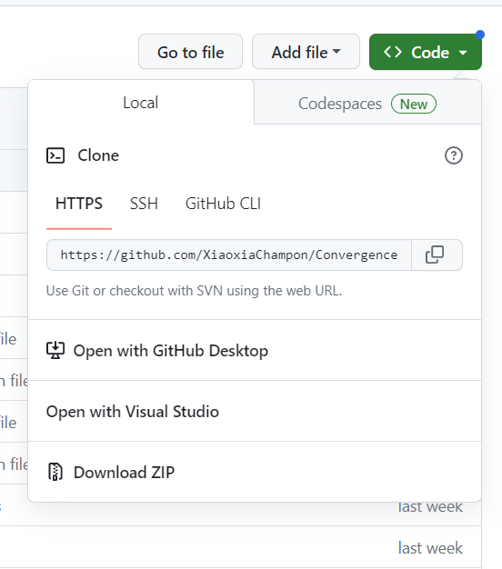

# Title

Teaching and Student Exploration of Convergence Concepts Using Interactive Shiny Applications

## Abstract:

Convergence of random variables is a notoriously difficult concept for students to understand and for teachers to explain. We demonstrate three commonly taught convergence concepts: in distribution/law, in probability, and almost surely through the use of interactive Shiny Applications. After many years of teaching with static illustrations, these tools, which provide dynamic visuals of the concepts, were developed to help students better understand the intuition behind which characteristics of a random sequence are important for convergence properties. These tools allow for multiple random sequences with known features to be simulated and the behavior changes of the random sequences to be explored through visual representations. While convergence in probability is generally only taught in the theoretical courses for statistics majors, the convergence in distribution/law topic is taught in most introductory statistics courses (via the central limit theorem). These applications should be useful for both the introductory audience and the statistics focused audience, although the latter may find them more beneficial. We advocate the use of these tools and other visuals as a hands-on activity that can improve the conceptual understanding of these difficult topics by allowing the teacher and students to visually inspect the underlying attributes associated with the theoretical concepts.

## Goals:

The motivation of this activity is to encourage communicating these abstract topics with an interactive investigation focused on visuals that enhance intuition and understanding. 

Participants will see a demonstration of the tools and walk away with a number of examples they can use in their class as an activity or as homework assignments (with included walk-throughs highlighting ways to effectively use the tools). The application is freely hosted on our website so participants will be able to take advantage of this visualization tool without needing knowledge of any programming language. They can share this app with their students and peers that teach these topics. 

# How to Use

There are two files demonstrating convergence concepts. To use them, you can view them online or you can download the files in this repo. To download, click the green `<> Code` button and then choose `Download ZIP`. Links to the 'live' presenation files are below.

- `ExploringConvergenceInDisribution.Rmd` - This file has visuals and interactive elements for investigating convergence in distribution only. Open the file in RStudio and knit the document.
    + <a href = "" target = "_blank">Presentation file</a>
- `ExploringConvergence.Rmd` - This file has visuals and interactive elements for investigating multiple types of convergence. Open the file in RStudio and knit the document
    + <a href = "" target = "_blank">Presentation file</a>
