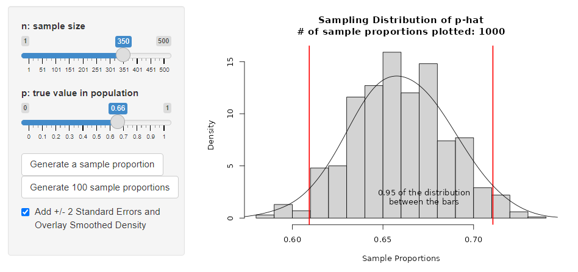
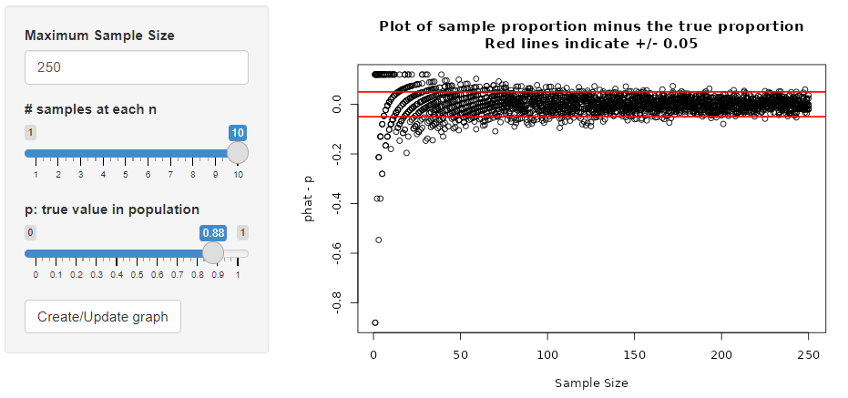
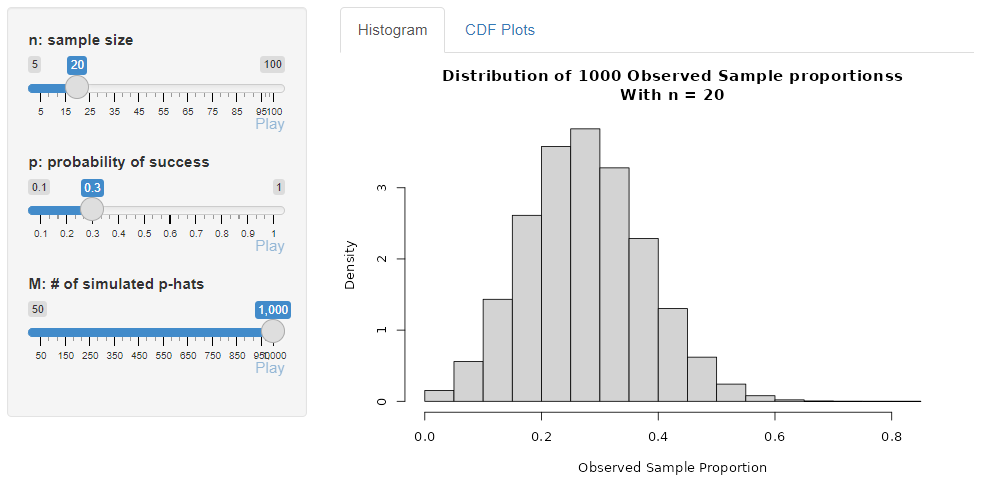
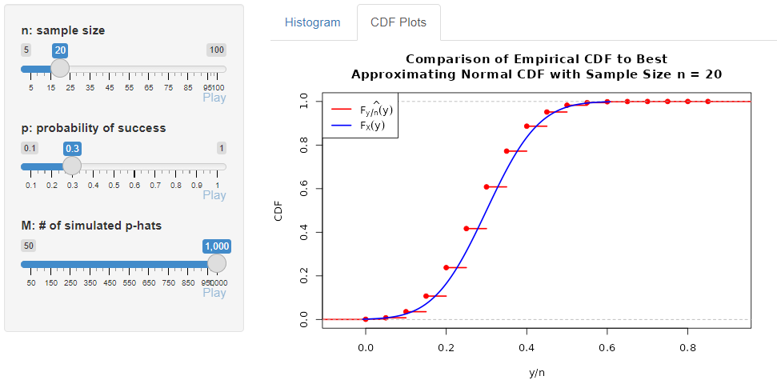
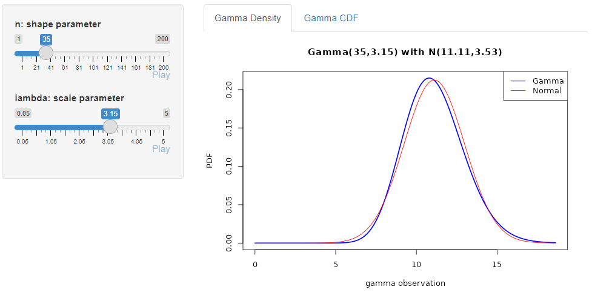
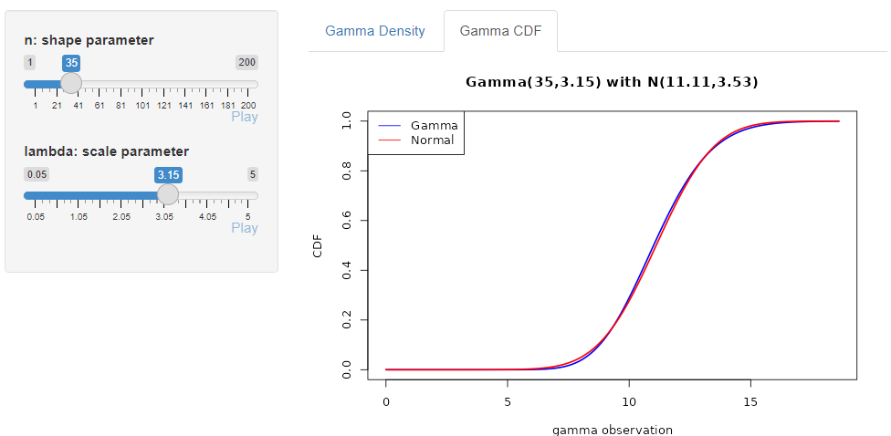
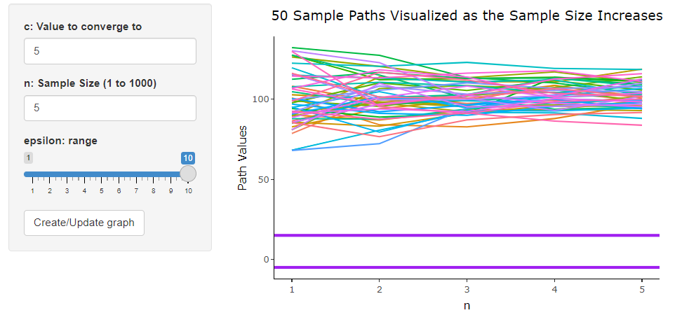
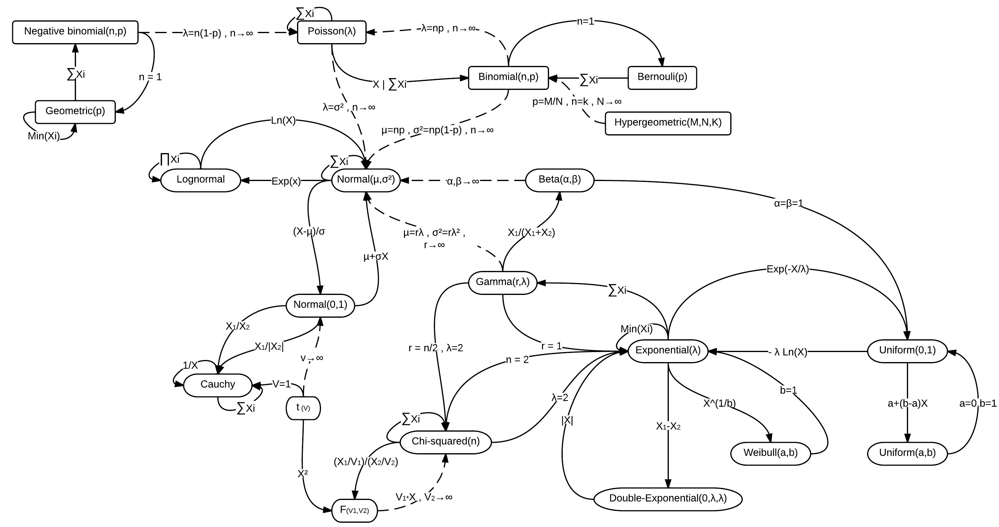

\setcounter{page}{158}

```{r setup, include=FALSE,warning=FALSE}
knitr::opts_chunk$set(echo = TRUE)
#add library
library(shiny)
library(shinydashboard)
library(ConvergenceConcepts)
library(ggplot2)
library(tidyr)
library(dplyr)
library(kableExtra)
library(plotly)
```


# Limit Theory

## Motivation

By limit theory we mean "what is the behavior our our random variable as some quantity grows?" Usually, we concern ourselves with the sample size ($n$) being the quantity that grows. We'll look at two major ideas:

- \vspace{0.15in}
- \vspace{0.15in}

### Motivating Example

A [Pew Research Center survey of 10,701 U.S. adults was conducted in March 2023](https://www.pewresearch.org/science/2023/05/16/americans-largely-positive-views-of-childhood-vaccines-hold-steady/). The survey asked participants questions related to their thoughts on vaccination. One question centered around the perceived efficacy of the MMR vaccine.

<div style = "float:right">
```{r, echo = FALSE, out.width = "250px"}
knitr::include_graphics("../img/pew.jpg")
```
</div>

The Center survey finds 88% of Americans say the benefits of childhood vaccines for measles, mumps and rubella (MMR) outweigh the risks, compared with just 10% who say the risks outweigh the benefits.

The sample proportion of 0.88 is an **estimate of the population proportion**. That is, the actual proportion of U.S. adults that believe the benefits outweigh the risks (call the true proportion $p$). 

Of course this is a single number estimate that would change if we sampled again. We can report the standard deviation of this sample proportion, called a standard error, to give us an idea of the variability in the estimate.  

Assuming independence between study participants, we can find an estimated standard error for this sample proportion using techniques learned earlier:

$$\widehat{SE(\hat{p})} = \sqrt{\frac{\hat{p}(1-\hat{p})}{n}} \approx \sqrt{\frac{0.88*0.12}{10701}} = 0.0031$$
Two big questions arise:

- First, can we provide a range of values we are 'confident' the true proportion falls in?\vspace{2.75in}
- Second, does our estimator $\hat{p}$ get closer to the true value $p$ for larger sample sizes?\vspace{1.75in}

These two questions can often be answered by looking at the *limiting* behavior (here as the sample size grows) of the estimator $\hat{p}$.

\newpage

## $\stackrel{d}{\rightarrow}$ (Convergence in distribution) Idea

To answer the first question: "Can we provide a range of values for the parameter?", let's consider determining the *sampling distribution* through simulation. 

Recall a **distribution** is just the\vspace{1in}

If we can simulate observing the variable, we can create many *realizations* of $\hat{p}$ to understand the *sampling distribution*. 

To do this for the above problem, we need to make some assumptions. Namely:

- \vspace{0.15in}
- \vspace{0.15in}

Using these assumptions, we can generate data from a Binomial distribution! 

Let's use the app on the '$\stackrel{d}{\rightarrow}$ Idea' tab available here: <https://shiny.stat.ncsu.edu/jbpost2/ConvergenceNotes/> 

We'll use the app to consider the sampling distribution of $\hat{p}$ when $p$ is 0.9 and $n$ is 10.

Instructions:

- "n: sample size" Slider: Move the  slider to the right to increase the sample size
- "p: true value in population" Slider: Move the  slider to the right to increase the true proportion
- "Generate a sample proportion": Click this button to add a single randomly generated sample proportion to the plot
- "Generate 100 sample proportions": Click this button to add 100 randomly generated sample proportions to the plot
- "Add +/- 2 Standard Error and Overlay Smoothed Density" Check this bot to add bars corresponding to two standard errors and also add a smoothed density overlayed

Put your thoughts from using the app here!

\newpage

As long as the distribution of $\hat{p}$ is roughly normal, we can see that 0.95 of the distribution falls within two standard errors of $p$. 

For 95\% of the $\hat{p}$ values we observe, adding and subtracting two standard errors would capture the true $p$. This means we could use something like 

$$\hat{p}\pm 2*\widehat{SE(\hat{p})}$$

as an interval to *capture* the true $p$. (Indeed this is the usual basic interval for a proportion!)


```{r, echo = FALSE, fig.align='center', out.width = "400px"}

```

\newpage

## $\stackrel{p}{\rightarrow}$ Idea

To answer the second question:  "does our estimator $\hat{p}$ get closer to the true value $p$ for larger sample sizes?", we could consider generating sample proportions for ever increasing values of the sample size and seeing how they behave. 

Let's use the app on the '$\stackrel{p}{\rightarrow}$ Idea' tab available here: <https://shiny.stat.ncsu.edu/jbpost2/ConvergenceNotes/> 

This app allows us to generate many sample proportions for varying $n$, subtract off the true value of $p$, and see how the difference between the observed $\hat{p}$ and $p$ changes on a plot.

Instructions:

- "Maximum Sample Size": Enter a number to increase/decrease the largest sample size to consider
- "# samples at each n" Slider: Move the slider to select the number of sample proportions to generate at each given sample size
- "p: true value in population": Move this slider to select the true proportion from the population
- "Create/Update graph": Click this button to create the initial graph or update the graph based off of new selections of the above values

Questions to answer:

- Start with one sample proportion at each $n$ and see the behavior of $\hat{p}-p$. 
- Now increase the number of sample proportions generated for each $n$. **What aspect of this relationship does this help us understand?**
- Increase the sample size you are considering. **What happens to the observed difference as $n$ grows?**

Put your thoughts from using the app here!

\newpage

We can see that $\hat{p}-p$ seems to get closer to 0. This indicates that $\hat{p}$ is in some sense *converging* to the true value of $p$!

```{r, echo = FALSE, fig.align='center', out.width = "400px"}

```

Now that we some basic intuition, let's formalize what we are talking about.

\newpage

## Definitions

By *limit*, *large-sample*, or *asymptotic* theory we mean we want to understand the behavior of some quantity, usually a *statistic*, as something changes, usually the sample size $n$. 

For instance, we will investigate the behavior of the sample mean, $\bar{Y}$, as the sample size grows. We'll look at questions like:

- When the distribution of a statistic (called a **sampling distribution**) is difficult to derive *exactly*, is there a good **approximating** distribution that can be used to get **approximate** probability statements about $\bar{Y}$?
- What value does $\bar{Y}$ *get close to* or *converge to* as the sample size grows? 

Answers to these questions will allows us to do inference (confidence intervals and hypothesis tests) and understand the quality of our estimator.

### Common Assumptions & Definitions

We often make some assumptions about how we observe our random variables in order to investigate these types of questions. For simplicity, we often assume we have a **random sample**.

Random Sample
: $Y_1,..., Y_n$ are a random sample (RS) of size $n$ if the random variables are independent and identically distributed (iid). \vspace{1in}

We'll often say 'assume we have a random sample' from some distribution or that 'our random variables are iid' from some distribution. These are equivalent ways of stating this assumption.

For the proportion example mentioned previously, we might formally state our assumption as follows:

\newpage

Statistic
: A function of $Y_1,Y_2,...,Y_n$ from a random sample that does not involve any unknown parameters is called a statistic.

Commonly studied statistics:  

- \vspace{0.15in}
- \vspace{0.15in}
- \vspace{0.15in}

Quantities that aren't statistics:  

- \vspace{0.25in}
- \vspace{0.25in}

One type of convergence we'll look at, convergence in distribution, is focused on the pattern in which these statistics are observed, that is, the **sampling distribution** of the statistics.

Recall that a distribution is just the pattern and frequency with which we observe a random variable. With a statistic, we give this distribution the special name of **sampling distribution**. 

This is because we can think of how that distribution is formed by considering repeated samples from the population, each sample producing the statistic of interest.

Sampling Distribution
: The distribution of a statistic.

\newpage

Recall, we used an app to investigate the sampling distribution of $\hat{p}$ earlier. We saw graphs that looked like the following:

```{r, echo = FALSE, fig.align='center', out.width = "400px"}

```

Using the app, you may have noticed that the sampling distribution of $\hat{p}$ looks like a bell curve for some combinations of $n$ and $p$. 

If we fix a $p$ and increase $n$, we will start to see a bell shape for large enough values of $n$! 

Later we'll see that a good **large-sample** distribution for $\hat{p}$ is the Normal distribution with mean $p$ and variance $p(1-p)/n$.  

We can see that there may be a distinction between the *actual* distribution for $\hat{p}$, which is a discrete distribution, and an approximating distribution, the Normal distribution. We call these by different names.

Exact Distribution
: The (sampling) distribution of a quantity that is valid for any sample size (or, occasionally, values of the parameters of the population distribution).

Large-Sample or Approximate Distribution
: A (sampling) distribution that is reasonable to use for a quantity for a *large* sample size (or occasionally other parameter values). 

We use the notation\vspace{1in}

to denote a large-sample approximating distribution.

In the sample proportion example, we would write

\newpage


## Convergence in Distribution

While convergence in distribution can be visually inspected with a histogram, to formally define **convergence in distribution** we use the cumulative distribution function or CDF.

Recall the Cumulative Distribution Function (or CDF) of a random variable $Y$ is defined as \vspace{0.75in}


For our binomial example, we can compare the CDF of binomial random variables to Normal random variables to see that the Binomial is 'converging' to the normal distribution in a sense! 

<div style = "float:left">
```{r, echo = FALSE, message = FALSE, out.width = "300px"}
p <- 0.15
n <- 20
plot_seq <- seq(from = -0.21, to = 10, by = 0.01)
NN <- length(plot_seq)
bin_cdf <- pbinom(plot_seq, size = n, prob = p)
norm_cdf <- pnorm(plot_seq, mean = n*p, sd = sqrt(n*p*(1-p)))

ecdf <- data.frame(
  y = c(bin_cdf, norm_cdf),
  CDF = c(rep(paste0("Bin(", n, ", ", p, ")"), NN), rep(paste0("N(", n*p, ", ", round(n*p*(1-p), 2), ")"), NN)),
  x = c(plot_seq, plot_seq)
)

ggplot(ecdf, aes(x = x, y = y, color = CDF)) + 
  geom_line(stat = "identity") +
  theme(text = element_text(size = 15), 
        plot.title = element_text(hjust = 0.5), 
        legend.text = element_text(size=15), 
        legend.position = c(0.8, 0.15)) +
  ggtitle("Binomial vs Normal CDF") +
  ylab("CDF") + 
  xlab("Observed Value")
```
</div>
<div style = "float:right">
```{r, echo = FALSE, message = FALSE,out.width = "300px"}
p <- 0.15
n <- 30
plot_seq <- seq(from = -0.21, to = 25, by = 0.01)
NN <- length(plot_seq)
bin_cdf <- pbinom(plot_seq, size = n, prob = p)
norm_cdf <- pnorm(plot_seq, mean = n*p, sd = sqrt(n*p*(1-p)))

ecdf <- data.frame(
  y = c(bin_cdf, norm_cdf),
  CDF = c(rep(paste0("Bin(", n, ", ", p, ")"), NN), rep(paste0("N(", n*p, ", ", round(n*p*(1-p), 2), ")"), NN)),
  x = c(plot_seq, plot_seq)
)

ggplot(ecdf, aes(x = x, y = y, color = CDF)) + 
  geom_line(stat = "identity") +
  theme(text = element_text(size = 15), 
        plot.title = element_text(hjust = 0.5), 
        legend.text = element_text(size=15), 
        legend.position = c(0.8, 0.15)) +
  ggtitle("Binomial vs Normal") +
  ylab("CDF") + 
  xlab("Observed Value")
```
</div>

<div class = "clearfix"></div>

\newpage

Convergence in Distribution
: Consider a sequence of random variables $Y_1,...,Y_n,...$ with corresponding CDFs $F_{Y_1}(y), ..., F_{Y_n}(y),..$. Then $Y_n$ converges in distribution to the random variable $Y$ (with CDF $F_Y(y)$) if
$$\lim_{n \rightarrow \infty} F_{Y_n}(y)=F_{Y}(y)$$
or equivalently
$$\lim_{n \rightarrow \infty} |F_{Y_n}(y)-F_{Y}(y)|=0$$
(at all points $y$ where $F_Y(y)$ is continuous). We denote this as
$$Y_n\stackrel{d}\rightarrow Y$$

The subscript $n$ notation here may be confusing. This is just to show the RV on the left is dependent on the sample size in some way. 

For our example with a Binomial/sample proportion, the distribution clearly depends on $n$. We could write the following to be explicit:\vspace{1.5in}

We'll prove (via the CLT) that the standardized version of these statistics converge to a standard Normal distribution! For example,

\newpage

Alternatively, for practical purposes we'll equivalently talk about 'large-sample' distributions using the $\stackrel{\bullet}{\sim}$ notation:\vspace{1in}


It is sometimes easier to work with MGFs rather than CDFs. In that case, we can use the following result:

Convergence of MGFs
: Consider a sequence of random variables $Y_1,...,Y_n,...$ with corresponding MGFs $m_{Y_1}(t), ..., m_{Y_n}(t),..$. Then $Y_n$ converges in distribution to the random variable $Y$ (with MGF $m_Y(t)$) if
$$\lim_{n \rightarrow \infty} m_{Y_n}(t) = m_Y(t)$$

<hr style="height:0px;border: none; border-top: 5px solid">

\newpage

### Proving $\stackrel{d}\rightarrow$ using CDFs

**Example:** Suppose that $Y_i\stackrel{iid}\sim U(0,1)$. That is,
$$f_Y(y) = \begin{cases}1 & 0<y<1\\0 & otherwise\end{cases}$$
and
$$F_Y(y) = \begin{cases} 0 & y < 0\\ y & 0\leq y < 1 \\ 1 & y\geq 1\end{cases}$$
What does the maximum from the sample converge in distribution to as $n$ grows?

Before proving it, let's generate many samples, find the maximum for each sample, and look at the empirical distribution via a histogram and CDF.

```{r,  echo = FALSE, message = FALSE,out.width = "300px", fig.align='center'}
library(tidyr)
M <- 500
#even better way to do this for many n values
ns <- c(10,20,50,100)
maxu <- as.data.frame(
  lapply(ns,
         FUN = function(x, M){replicate(M, max(runif(n = x, 0, 1)))},
         M = M),
         col.names = paste0("X", ns)
                     )
maxu_long <- pivot_longer(maxu, cols = everything(), names_to = "n", values_to = "maximum") %>%
  mutate(Sample_Size = factor(n, levels = paste0("X", ns), labels = paste0("n = ", ns), ordered = TRUE))
ggplot(maxu_long, aes(x=maximum)) +
  geom_histogram(bins = 50)+
  facet_wrap( ~ Sample_Size,ncol = 2)+
  theme(text = element_text(size = 15),
        plot.title = element_text(hjust = 0.5),
        legend.text = element_text(size=15),
        legend.position = c(0.1, 0.85)) +
  ggtitle("Distribution of Maximum of uniform (0, 1)") +
  ylab("Frequency") +
  xlab("Observed Maximum Value")


ggplot(maxu_long, aes(x=maximum)) +
  stat_ecdf()+
  facet_wrap( ~ Sample_Size,ncol = 2)+
  theme(text = element_text(size = 15),
        plot.title = element_text(hjust = 0.5),
        legend.text = element_text(size=15),
        legend.position = c(0.1, 0.85)) +
  ggtitle("Distribution of Maximum of uniform (0, 1)") +
  ylab("Empirical CDF") +
  xlab("Observed Maximum Value")
```

It appears that the distribution converges to a random variable that always takes on 1. We'd say there is a **point mass** at 1. 

If $W$ is a random variable that always takes on the constant $c$ then 
$$f_W(w) = \begin{cases} 1 & w = c\\ 0 & otherwise\end{cases}$$
$$F_W(w) = \begin{cases} 0 & w < c\\ 1 & w\geq c\end{cases}$$

We also said we could look at 
$$\lim_{n \rightarrow \infty} |F_{Y_n}(y)-F_{Y}(y)|=0$$
for convergence in distribution. This difference in CDFs can be plotted in three dimensions.


```{r, echo = FALSE,out.width = "300px", fig.align='center'}
ns <- c(1:50)*4
maxs <- as.data.frame(
  lapply(ns, 
         FUN = function(x){
           replicate(100, max(runif(n = x)))
         }
  ),
  col.names = paste0("n",ns))

#now find the ecdf for each sample size (each column)
ecdfs <- apply(X = maxs, MARGIN = 2, FUN = ecdf)

#find the corresponding point mass at 1 values to compare against
max_values <- 1:100/100
pms <- c(rep(0, 99), 1)
diffs <- lapply(X = 1:length(ecdfs), FUN = function(x) abs(ecdfs[[x]](max_values) - pms))
#now we have the ns, ybars, and diffs to plot
plot_data <- expand.grid(max_values = max_values, ns = ns)
plot_data$diffs <- unlist(diffs) 
wireframe(diffs ~ max_values + ns, 
                          data = plot_data, 
                          scales = list(arrows = FALSE), 
                          drape = TRUE, 
                          colorkey = TRUE, 
                          zlab = list(expression(hat(l)[n] ~ "(x)=|" ~ hat(F)[n] ~ "(x)-" ~ F ~ "(x)|"), rot = 90), 
                          main = "Convergence in Distribution?", 
                          xlab="max")
```

Let's formally prove that the maximum of $n$ iid $U(0,1)$ RVs converges to a RV with a point mass at 1.

\newpage

**Example:** Consider again a random sample of $U(0,1)$ RVs. 

What does $W = n(1-Y_{(n)})$ converge in distribution to as $n$ grows? Can we describe a rule of thumb for when the approximating distribution is reasonable?

```{r,message=FALSE,echo=FALSE, fig.align = 'center', out.width = '350px'}
#W = n(1-Y_{(n)})
M <- 500
#even better way to do this for many n values
ns <- c(5,10,25,100)
maxu <- as.data.frame(
  lapply(ns,
         FUN = function(x, M){replicate(M, x*(1-max(runif(n = x, 0, 1))))},
         M = M),
  col.names = paste0("X",ns)
                      )
maxu_long <- pivot_longer(maxu, cols = everything(), names_to = "n", values_to = "W") %>%
  mutate(Sample_Size = factor(n, levels = paste0("X", ns), labels = paste0("n = ", ns), ordered = TRUE))

ggplot(maxu_long, aes(x=W)) +
  geom_histogram(bins = 50)+
  facet_wrap( ~ Sample_Size, ncol = 2)+
  theme(text = element_text(size = 15),
        plot.title = element_text(hjust = 0.5),
        legend.text = element_text(size=15),
        legend.position = c(0.1, 0.85)) +
  ggtitle("Distribution of n*(1-max) from U(0,1)") +
  ylab("Frequency") +
  xlab("Observed Maximum Value")


ggplot(maxu_long, aes(x = W)) +
  stat_ecdf()+
  facet_wrap( ~ Sample_Size,ncol = 2)+
  theme(text = element_text(size = 15),
        plot.title = element_text(hjust = 0.5),
        legend.text = element_text(size=15),
        legend.position = c(0.1, 0.85)) +
  ggtitle("Distribution of n*(1-max) from U(0,1)") +
  ylab("Empirical CDF") +
  xlab("Observed Maximum Value")

```

\newpage

This one doesn't appear to be converging to a point mass. Let's use the limit of the CDF to determine what this random variable converges to.\vspace{4in}

Let's compare the distribution of $W = n(1-Y_{(n)})$ with $X \sim exp(1)$ via a plot of 
$$|F_{Y_n}(y)-F_{Y}(y)|$$

```{r, echo = FALSE,out.width = "270px",fig.align='center'}
ns <- c(1:100)
maxs <- as.data.frame(
  lapply(ns, 
         FUN = function(x, M){replicate(500, x*(1-max(runif(n = x, 0, 1))))}),
  col.names = paste0("n",ns))

#now find the ecdf for each sample size (each column)
ecdfs <- apply(X = maxs, MARGIN = 2, FUN = ecdf)

#find the corresponding point mass at 1 values to compare against
max_values <- 1:50/10
exp_cdfs <- pexp(max_values, rate = 1)
diffs <- lapply(X = 1:length(ecdfs), FUN = function(x) abs(ecdfs[[x]](max_values) - exp_cdfs))
#now we have the ns, ybars, and diffs to plot
plot_data <- expand.grid(max_values = max_values, ns = ns)
plot_data$diffs <- unlist(diffs) 
wireframe(diffs ~ max_values + ns, 
                          data = plot_data, 
                          scales = list(arrows = FALSE), 
                          drape = TRUE, 
                          colorkey = TRUE, 
                          zlab = list(expression(hat(l)[n] ~ "(x)=|" ~ hat(F)[n] ~ "(x)-" ~ F ~ "(x)|"), rot = 90), 
                          main = "Convergence in Distribution?", 
                          xlab="W")
```

\newpage

### Proving $\stackrel{d}\rightarrow$ using MGFs

**Example:** Suppose $Y\sim Bin(n,p)$ where $np \rightarrow \lambda$ as $n$ grows.  Show $Y\stackrel{d}\rightarrow Poi(\lambda)$. 

First, let's compare plots to see that the relationship seems to hold. We'll create three different binomial and poisson plots with the same ratio for $n$ and $p$. 

Consider how well do the PMFs match up for the following situations:

```{r, echo = FALSE}
#Binomial convergence to Poisson
#choose n and p combinations so that np is always 5
n <- c(10, 100, 1000)
p <- c(0.5, 0.05, 0.005) 

#number of datasets to create
N <- 100000
x <- 0:17
```

- $n = 10, p = 0.5 \rightarrow n*p = 5$

```{r echo = FALSE, fig.align = 'center', out.width = '300px'}

i <- 1
plot(x, 
     y = dbinom(x,
                size = n[i], 
                prob = p[i]), 
     type = "h",
     col = "red",
     lwd = 2,
     xlab = "# of successes", 
     ylab = "PMF value", 
     main = paste0("Bin/Poi: n=", n[i], ", p=", p[i]))
    #overlay poisson with mean np
lines(x + 0.2, 
      dpois(x, lambda = n[i]*p[i]), 
      type = "h", 
      col = "blue", 
      lwd = 2)
legend(x = "topright", legend = c("Binomial", "Poisson"), col = c("red", "blue"), lwd = 2)
```

- $n = 100, p = 0.05 \rightarrow n*p = 5$

```{r echo = FALSE, fig.align = 'center', out.width = '300px'}

i <- 2
plot(x, 
     y = dbinom(x,
                size = n[i], 
                prob = p[i]), 
     type = "h",
     col = "red",
     lwd = 2,
     xlab = "# of successes", 
     ylab = "PMF value", 
     main = paste0("Bin/Poi: n=", n[i], ", p=", p[i]))
    #overlay poisson with mean np
lines(x + 0.2, 
      dpois(x, lambda = n[i]*p[i]), 
      type = "h", 
      col = "blue", 
      lwd = 2)
legend(x = "topright", legend = c("Binomial", "Poisson"), col = c("red", "blue"), lwd = 2)
```

\newpage

- $n = 1000, p = 0.005 \rightarrow n*p = 5$

```{r echo = FALSE, fig.align = 'center', out.width = '300px'}
i <- 3
plot(x, 
     y = dbinom(x,
                size = n[i], 
                prob = p[i]), 
     type = "h",
     col = "red",
     lwd = 2,
     xlab = "# of successes", 
     ylab = "PMF value", 
     main = paste0("Bin/Poi: n=", n[i], ", p=", p[i]))
    #overlay poisson with mean np
lines(x + 0.2, 
      dpois(x, lambda = n[i]*p[i]), 
      type = "h", 
      col = "blue", 
      lwd = 2)
legend(x = "topright", legend = c("Binomial", "Poisson"), col = c("red", "blue"), lwd = 2)
```

Now that we've visually convinced ourselves this should work, let's prove it!

Suppose $Y\sim Bin(n,p)$ where $np \rightarrow \lambda$ as $n$ grows.  Show $Y\stackrel{d}\rightarrow Poi(\lambda)$. 

\newpage

**Example:** After we learn about the central limit theorem (CLT), we'll see a (relatively) easy way to prove that a $Y\sim Gamma(n, \lambda)$, properly standardized, converges to a standard normal distribution.  That is, 
$$W = \frac{Y-n/\lambda}{\sqrt{n}/\lambda}\stackrel{d}{\rightarrow} Z \sim N(0,1)$$
We can prove it using MGFs directly. Let's look through the proof below:

Goal: Start with the MGF of the standardized random variable and try to show it converges to a standard 
normal MGF ($e^{t^2/2}$) as $n\rightarrow\infty$.


\begin{align*} 
m_Z(t) &= E\left(e^{t\left(\frac{Y-n/\lambda}{\sqrt{n}/\lambda}\right)}\right)\\
       &= E\left(e^{\frac{t\lambda}{\sqrt{n}}Y}\right)e^{-t\sqrt{n}}\\
       &= \left(\frac{1}{1-\frac{(\lambda t)/\sqrt{n}}{\lambda}}\right)^{n}e^{-t\sqrt{n}}\\
       &= \left(\frac{e^{-t/\sqrt{n}}}{1-t/\sqrt{n}}\right)^{n}\\
\end{align*}

As we want the limit of this quantity as $n$ goes to infinity, consider that this involves $n$ in the term and is raised to the $n$. We saw the result:

$$\lim_{n\rightarrow\infty}(1+a_n/n)^n=e^a$$
where $\lim_{n\rightarrow\infty}a_n=a$.  A rewrite can allow us to use this!

\begin{align*}
      &= \left(1+\frac{n\left(\frac{e^{-t/\sqrt{n}}}{1-t/\sqrt{n}}-1\right)}{n}\right)^{n}\\
\end{align*}

Now we can just consider what happens to the numerator of the second term as 
$n$ grows.  That is, we just need to consider
$$\lim_{n\rightarrow\infty}n\left(\frac{e^{-t/\sqrt{n}}}{1-t/\sqrt{n}}-1\right)$$
Using a common denominator and then applying a Taylor series expansion of the 
$e$ term about 0,
$$e^{-t/\sqrt{n}}=1-t/\sqrt{n}+t^2/(2n)-t^3/(3!n^{3/2})+...,$$
we can rewrite this as
\begin{align*}
    &= \lim_{n\rightarrow\infty}n\left(\frac{t^2/(2n)-t^3/(3!n^{3/2})+...}{1-t/\sqrt{n}}\right)\\
    &= \lim_{n\rightarrow\infty}\left(\frac{t^2/2-t^3/(3!n^{1/2})+...}{1-t/\sqrt{n}}\right)\\
    &= t^2/2\\
\end{align*}

Thus, our MGF converges $e^{t^2/2}$. This is the MGF of a standard normal random variable! Therefore,

$$W = \frac{Y-n/\lambda}{\sqrt{n/\lambda^2}}\stackrel{d}{\rightarrow} Z \sim N(0,1)$$

\newpage

### Central Limit Theorem

One of the most important theorems in statistics is the Central Limit Theorem (CLT). The CLT gives us a general result about the large-sample behavior of a sample mean.

Central Limit Theorem (CLT)
: Suppose that $Y_i\stackrel{iid}\sim f_Y$ where $E(Y)=\mu$ and $Var(Y)=\sigma^2 < \infty$.  Define $\bar{Y}=\frac{1}{n} \sum_{i=1}^{n} Y_i$ and $Z \sim N(0, 1)$. Then the standardized sample mean converges in distribution to a standard normal random variable.
$$\frac{\bar{Y}-\mu}{\sigma/\sqrt{n}} \stackrel {d} {\rightarrow} Z$$

Practically, we can say that a good approximating distribution or large-sample distribution for $\bar{Y}$ is
$$\bar{Y}\stackrel{\bullet}\sim N(\mu, \sigma^2/n)$$


#### CLT Applied to a Sample Proportion

**Example:** A common application of the CLT is to the sample proportion from a Binomial experiment.\vspace{4in}


\newpage

You've likely seen the Normal approximation to the Binomial before. You may even know a rule of thumb for using it. 

The app under the 'Convergence in Distribution' tab, 'Central Limit Theorem' subtab available here: <https://shiny.stat.ncsu.edu/jbpost2/ConvergenceNotes/> will allow us to explore this.

This app simulates sample proportions from a given binomial distribution. Use the app to 

- Explore the relationship between $\hat{p}$ and the corresponding Normal distribution (the larger the $M$ value the more precisely the graph mimics the exact distribution of $\hat{p}$)
- Either verify the rule of thumb you know or try and come up with a rule of thumb for when the approximation is reasonable

Put your thoughts from using the app here!\vspace{1.75in}

```{r, echo = FALSE, fig.align='center', out.width='300px'}


```

\newpage


#### CLT Applied to a Sum 

Recall the result: \vspace{1.2in}

As a special case of this, we can see that a Normal random variable multiplied by a constant is still Normally distributed, just with a different mean and variance. \vspace{1in}

Under the same assumptions as the CLT, since $n\bar{Y} = \sum_{i=1}^{n}Y_i$ we have the following results:
$$\frac{\sum_{i=1}^{n} Y_i -n\mu}{\sqrt{n}\sigma}\stackrel{\bullet}{\sim}N(0, 1)$$
or

$$\sum_{i=1}^{n} Y_i \stackrel{\bullet}{\sim}N(n\mu, n\sigma^2)$$


**Example:** Based on this result, what is a good large-sample distribution for $Y\sim Bin(n, p)$?

\newpage

#### CLT Applied to a Gamma 

**Example:** Earlier we proved that $Y\sim Gamma(n, \lambda)$, properly standardized, converges to a standard normal distribution. That is, 
$$W = \frac{Y-n/\lambda}{\sqrt{n}/\lambda}\stackrel{d}{\rightarrow} Z \sim N(0,1)$$

Rather than use MGFs, we can apply the CLT in a clever way!


\newpage


##### Convergence Exploration

- Suppose that $Y \sim Gamma(n, \lambda)$. Or, assume that $Y = \sum_{i=1}^{n} X_i$ where $X_i\stackrel{iid}\sim Gamma(1, \lambda)$. 
$$f_Y(y) = \frac{\lambda^\alpha}{\Gamma(\alpha)}y^{\alpha -1}e^{-\lambda y}$$
with mean $E(Y) = \alpha/\lambda$ and variance $Var(Y) = \alpha/\lambda^2$.
- We again showed we can approximate a gamma by a Normal distribution.  

The app under the 'Convergence in Distribution' tab, 'Central Limit Theorem' subtab available here: <https://shiny.stat.ncsu.edu/jbpost2/ConvergenceNotes/> will allow us to explore this.

- Can you develop a rule of thumb around $\alpha$ ($n$ here) and $\lambda$ for when a Normal distribution may be a reasonable approximation?  Remember we look for the following in each graph:  
    + Histogram: when does it become a symmetric bell-shape?
    + CDF comparison: When do the CDFs essentially overlap?

Put your thoughts from using the app here!\vspace{1in}

```{r, echo = FALSE, fig.align='center', out.width='300px'}


```

\newpage

### CLT Importance 

Practically, why is the CLT so important? 

- The CLT gives us a distribution we can use to find probabilities when we deal with most sample sums and sample means.
- Knowing a large-sample distribution allows us to find (approximate) probabilities when exact probabilities may be too difficult to find.
- This means we can do approximate inference in many cases!

**Example:**

- Suppose we know $\sigma$ and we want inference for $\mu$.
- If we have a random sample $Y_1,...,Y_n$, we know  $\bar{Y}\stackrel{\bullet}{\sim}N(\mu,\sigma^2/n)$ ($\mu$ only unknown)
- We can make an approximate claim about $\mu$ via a confidence interval derived from an argument similar to that below:

\begin{align*}
P(-1.96<Z<1.96) &= 0.95\\
\Leftrightarrow P\left(-1.96<\frac{\bar{Y}-\mu}{\sigma/\sqrt{n}}<1.96\right) &= 0.95\\
\Leftrightarrow P\left(\bar{Y}-1.96\sigma/\sqrt{n}<\mu<\bar{Y}+1.96\sigma/\sqrt{n}\right) &= 0.95\\
\end{align*}

- That is, there is a 95\% probability the RVs
$\bar{Y}-1.96\sigma/\sqrt{n}$ and $\bar{Y}+1.96\sigma/\sqrt{n}$ capture $\mu$!
- In practice we observe a value for $\bar{Y}$ as $\bar{y}$. We then lose the ability to talk about probability but instead asy we are 95\% confident the observed interval contains $\mu$.
- Note: No assumption about $Y$'s distribution made other than finite variance!

\newpage

## Convergence in Probability

### Definition 

We saw that the estimator of $p$, $\hat{p}$, from the Binomial example seemed to be observed closer and closer to $p$ for larger sample sizes. Additionally, we saw a good large-sample distribution for $\hat{p}$ is
$$\hat{p}\stackrel{\bullet}\sim N\left(p, \frac{p(1-p)}{n}\right)$$

Does this large-sample distribution support the 'convergence' of $\hat{p}$ to $p$ idea?  
\vspace{1.5in}

More formally, we're going to take on the idea of **convergence in probability to a constant**. First, let's define convergence in probability generally.

Convergence in Probability
: A sequence of RVs $Y_1,...,Y_n,...$ converges in probability to a RV $Y$ if for every $\epsilon>0$
$$\lim_{n\rightarrow\infty}P(|Y_n-Y|\geq \epsilon)=0 \iff 
\lim_{n\rightarrow\infty}P(|Y_n-Y|<\epsilon)=1$$
This is denoted as 
$$Y_n\stackrel{p}{\rightarrow}Y$$

We'll mostly care about convergence in probability to a constant, call it $c$. We can see the definition in this case can be simplied to the following:


\newpage


**Example** - We can visualize this idea.

Assume that $Y_i\stackrel{iid}\sim N(0,1)$. Let's investigate the behavior of 
$$X = \frac{1}{n^2}\sum_{i=1}^{n}Y_i$$
To put this in the context of the definition, let's refer to $X$ explicitly as a function of $n$:
  $$X_n = \frac{1}{n^2}\sum_{i=1}^{n}Y_i$$
    We want to understand the behavior of $X_n$ as n grows. We'll see that $X_n\stackrel{p}\rightarrow 0$, which implies that for any $\epsilon>0$ we have

\vspace{1in}

To visualize this, we can consider **sample paths** of $X_n$. That is, we can look at a particular sequence of $y_i$'s that will generate a sequence of $x$ and see how the values change. 
  
  Consider the following 6 values randomly sampled from a $N(0,1)$ and the corresponding sequence of $x_n$ values.
  ```{r, echo = FALSE}
  set.seed(1)
  ys <- rnorm(6)
  xn <- cumsum(ys)/((1:length(ys))**2)
  ```
  
$y$ sequence      | $x$ sequence
------------------|--------------
$y_1$ = `r ys[1]` | $x_1$ = `r ys[1]`$/1^2$ = `r xn[1]`
$y_2$ = `r ys[2]` | $x_2$ = (`r ys[1]`+`r ys[2]`)$/2^2$ = `r xn[2]`
$y_3$ = `r ys[3]` | $x_3$ = (`r ys[1]`+`r ys[2]`+`r ys[3]`)$/3^2$ = `r xn[3]`
$y_4$ = `r ys[4]` | $x_4$ = (`r ys[1]`+...+`r ys[4]`)$/4^2$ = `r xn[4]`
$y_5$ = `r ys[5]` | $x_5$ = (`r ys[1]`+...+`r ys[5]`)$/5^2$ = `r xn[5]`
$y_6$ = `r ys[6]` | $x_6$ = (`r ys[1]`+...+`r ys[6]`)$/6^2$ = `r xn[6]`
  
**If we consider multiple sample paths, then convergence in probability to 0 of this sequence implies that the proportion of sample paths outside of $\pm \epsilon$ should go to zero.**

\newpage

Let's plot our sample path with an $\epsilon = 0.05$:

```{r, echo = FALSE, out.width='325px'}
epsilon <- 0.05
n <- 6
plot_data <- data.frame(n = 1:n, xn = xn)
ggplot(plot_data, aes(x = n, y = xn)) + 
  geom_line() + 
  ylim(c(-0.75,0.75)) + 
  ggtitle("A sample path of Xn") + 
  geom_abline(intercept = -epsilon, slope = 0, color = "red") + 
  geom_abline(intercept = epsilon, slope = 0, color = "red") + 
  theme(legend.position = "none") +
  scale_x_continuous("n", breaks = 1:n, labels = as.character(1:n))
#plot(x = 1:n, 
#     y = xn, 
#     type = "l", 
#     main = "A sample path of X_n", 
#     ylim = c(-1, 1),
#     xlab = "n",
#     lwd = 2)
#abline(h = c(-epsilon, epsilon), col = "red", lwd = 2)
```

Now let's add 9 more sample paths:
    
```{r, echo = FALSE, out.width='325px', warning = FALSE}
  #gen sample path function
  get_path <- function(n){
    xn <- cumsum(rnorm(n))/((1:n)^2)
  }
  M <- 10
  set.seed(1)
  paths <- replicate(M, get_path(n))
  plot_data <- data.frame(xn = c(paths), n = rep(1:n, times = M), path = as.factor(rep(1:M, each = n)))
  
  ggplot(plot_data, aes(x = n, y = xn, color = path)) + 
    geom_line()  + 
    ggtitle("A sample path of Xn") + 
    geom_abline(intercept = -epsilon, slope = 0, color = "red", size = 1.1, lty = "dashed") + 
    geom_abline(intercept = epsilon, slope = 0, color = "red", size = 1.1, lty = "dashed") + 
    annotate("rect", xmin = 3.75, xmax = 4.25, ymin = -0.75, ymax = 0.75, alpha = .2) +
    annotate("text", x = 4, y = 0.8, label = "7/10 fall within\nepsilon bounds", col = "darkblue") + 
    theme(legend.position = "none") +
    scale_x_continuous("n", breaks = 1:n, labels = as.character(1:n))
  
  ##add what xiaoxia has below with the bars and proportion business and ggploty this bitch 
  
  
  # plot(x = 1:n, 
  #      y = xn, 
  #      type = "l", 
  #      main = "A sample path of X_n", 
  #      ylim = c(-1, 1),
  #      xlab = "n", 
  #      lwd = 2)
  # for (i in 1:9){
  #   lines(x = 1:n, y = paths[,i], lwd = 2)
  # }
  # abline(h = c(-epsilon, epsilon), col = "red")
  
```
  
What we hope to see is that the proportion of lines falling outside of the $\epsilon$ bars goes to 0 (for any chosen $\epsilon$)!
    
\newpage

**Example** - Suppose we have a random sample from a Normal distribution with mean 10 and standard deviation 1. What do you think $W = (\bar{Y})^2$ converges to in probability? Take an educated guess!\vspace{0.75in}

The app under the 'Convergence in Probability' tab, 'Definition' subtab available here: <https://shiny.stat.ncsu.edu/jbpost2/ConvergenceNotes/> will allow us to explore this.

- Select the value c that you guessed $W$ converges to in probability.
- Choose a sample size to go up to (start smaller and then get larger once you have a good idea).
- Select an $\epsilon$ range.
- Look for the proportion of lines (50 sample paths are generated) falling outside of the $\epsilon$ bars going to 0! If you have that, then you probably guessed the right value!\vspace{2in}

```{r, echo = FALSE, fig.align='center', out.width="300px"}

```

\newpage

### Inequalities

To prove convergence in probability, we'll sometimes rely on some very famous inequalities. These will help us to show the probability goes to 0 or 1.

Markov's Inequality
: If $X$ is a nonnegative RV (support has no negative values) for which $E(X)$ exists, then for $t>0$
$$P(X\geq t)\leq \frac{E(X)}{t}$$

Example: If $X\sim exp(1)$ then $P(X\geq t)=e^{-t}$ and $E(X)/t=1/t$.

```{r, echo = FALSE, fig.align = 'center', out.width = "250px"}
x <- 1:120/20
plot(x, y = 1/x, type = "l", ylim = c(0,1), col = "blue", lwd = 2)
lines(x, y = exp(-x), type = "l", col = "green", lwd = 2)
legend("topright", legend = c("1/t", "exp(-t)"), col = c("blue", "green"), lwd = 2)
```

Let's prove Markov's inequality.

\newpage

Chebychev's Inequality 
: Let $X$ be a RV with mean = $\mu$ and variance = $\sigma^2$, then for $t>0$ 
  $$P(|X-\mu|\geq t)\leq \frac{\sigma^2}{t^2}$$

Let's prove Chebychev's inequality is true.

\vspace{3.5in}

Example:  If $t=\sigma k$ for $k>0$, we can apply Chebychev's to get
$$P\left(|X-\mu|\geq k\sigma\right)\leq \frac{\sigma^2}{k^2\sigma^2}=\frac{1}{k^2}$$
For $k=2$ we have $P\left(|X-\mu|\geq 2\sigma\right)\leq 1/4$.

Practically, what can we take home from this?

- At least 75\% of a RVs distribution lies within 2 standard deviations of the mean (if these moments exist)
- Regardless of distribution! (if moments exist)
- If $X\sim N(\mu,\sigma^2)$ we know $P(|X-\mu|\geq 2\sigma)\approx 0.05$. The bound isn't always very tight!

\newpage  

### WLLN

One of the most important results regarding convergence in probability is called the Law of Large Numbers (LLN).

(Weak) Law of Large Numbers (WLLN)
: Suppose $Y_i\stackrel{iid}\sim f$ where the mean and variance of $Y_i$ exist. Then $$\bar{Y}=\frac{1}{n}\sum_{i=1}^{n}Y_i\stackrel{p}\rightarrow E(Y)=\mu$$

Note that the variance assumption is actually not needed but will help us facilitate an easy proof. Let's use our inequalities to prove this result!
\vspace{4in}

- Big picture goal is to estimate parameters such as $\mu$
- If we get a RS we know that $\bar{Y}$ will be a 'close' to $\mu$ for `large' samples
- Applies to the **average of any independent random variables with the same finite mean**

\newpage


**Example** - Let $Y_i\stackrel{iid}{\sim}N(\mu, \sigma^2)$. What does $\bar{Y}$ converge to? What does $\frac{1}{n}\sum_{i=1}^{n}Y_i^2$ converge to?

\vspace{2in}

### Continuity Theorems

The WLLN is also quite useful when combined with the continuity theorem.

Continuity Theorem
: If $Y_1,Y_2,Y_3,...$ converges to $Y$ (in probability or in distribution) and $g()$ is a continuous function then $g(Y_1),g(Y_2),g(Y_3)...$ converges to $g(Y)$ (in probability or in distribution). 

**Example (exploration example proved)** - 
Suppose we have a random sample from a Normal distribution with mean 10 and standard deviation 1. Consider $W = (\bar{Y})^2$. What does this converge to in probability?

\vspace{2in}

Note: The continuity theorem also works for convergence in distribution!

**Example** - Suppose that $Y_i\stackrel{iid}\sim gamma(\alpha, \lambda)$. We have that 
$$\frac{\bar{Y}-\alpha/\lambda}{\frac{\sqrt{\alpha}}{\lambda\sqrt{n}}}\stackrel{d}\rightarrow Z$$
where $Z\sim N(0,1)$. By the continuity theorem we have that 
$$\left(\frac{\bar{Y}-\alpha/\lambda}{\frac{\sqrt{\alpha}}{\lambda\sqrt{n}}}\right)^2\stackrel{d}\rightarrow Z^2$$
and recall that a standard Normal squared is distributed as a $\chi^2_1$ or a $gamma(1/2, 1/2)$. 

\newpage

#### Other Standard Limit Results Work Too!

Most of the common limit theorem ideas from calculus follow here as well ($\theta$ and $\lambda$ are constants below):

$$\mbox{If }Y\stackrel{p}{\rightarrow}\theta, X\stackrel{p}{\rightarrow}\lambda\mbox{ then }Y\pm X\stackrel{p}{\rightarrow}\theta\pm\lambda$$


**Example** - Consider the `biased' version of the sample variance, $S_n^2=\frac{1}{n}\sum_{i=1}^{n}(Y_i-\bar{Y})^2$.  Let's show $S_n^2\stackrel{p}{\rightarrow}\sigma^2$

\newpage

### $\stackrel{d}\rightarrow$ & $\stackrel{p}\rightarrow$ Relationship

**Convergence in probability implies convergence in distribution.** However, the converse is not true generally (**convergence in distribution does not imply convergence in probability**). 

**Example** - Suppose $X\sim Beta(2,2)$ then $1-X$ is also distributed as Beta(2,2) (recall the symmetry of the Beta distribution with equal $\alpha$ and $\beta$).

Define a sequence of RVs to be $X_n=X$ for all $n$.  Then $X_n\stackrel{d}{\rightarrow}1-X\sim Beta(2,2)$.

\vspace{2in}

Now consider convergence in probability, does $X_n\stackrel{p}{\rightarrow}1-X$?  

\newpage


**Convergence in distribution to a constant** - If $Y_n\stackrel{d}{\rightarrow}c$ then $Y_n\stackrel{p}\rightarrow c$.

Why does it makes sense that convergence in distribution to a constant implies convergence in probability to that constant? Consider our example where we look at the maximum from a random sample of $U(0,1)$ RVs. Below are plots of the distribution of the sample max for varying $n$ values.

```{r echo= FALSE}
#######################################################################
#Generate many samples of size n from Uniform(0,1), find max for each sample to see the distribution of max
n<-c(3,10,100,10000)
N<-20000
maxes<-matrix(,nrow=N,ncol=length(n))

#loop over sample sizes
for (j in 1:length(n)){
  #loop through data sets
  for (i in 1:N){maxes[i,j]<-max(runif(n[j]))}
}

par(mfrow=c(1,length(n)))
hist(maxes[,1],breaks=seq(0,1,by=0.005),main=paste("Hist of Max, n=",n[1],sep=""),xlab="max",
ylab="Dist of max")
hist(maxes[,2],breaks=seq(0,1,by=0.005),main=paste("Hist of Max, n=",n[2],sep=""),xlab="max",
ylab="Dist of max")
hist(maxes[,3],breaks=seq(0,1,by=0.005),main=paste("Hist of Max, n=",n[3],sep=""),xlab="max",
ylab="Dist of max")
hist(maxes[,4],breaks=seq(0,1,by=0.005),main=paste("Hist of Max, n=",n[4],sep=""),xlab="max",
ylab="Dist of max")
par(mfrow = c(1,1))
```

\newpage

Another really useful theorem relating convergence results is called Slutsky's Theorem.

Slutsky's Theorem
: If $X_n\stackrel{d}\rightarrow X$ and $Y_n\stackrel{p}\rightarrow a$, then 

- $X_nY_n\stackrel{d}\rightarrow aX$
- $X_n+Y_n\stackrel{d}\rightarrow X+a$


\newpage

Slutsky's theorem is extremely useful for creating hypothesis tests and confidence intervals! Recall the example we talked about when discussing the importance of the CLT:

**Example:**

- Suppose we know $\sigma$ and we want inference for $\mu$.
- If we have a random sample $Y_1,...,Y_n$, we know  $\bar{Y}\stackrel{\bullet}{\sim}N(\mu,\sigma^2/n)$ ($\mu$ only unknown)
- We can make an approximate claim about $\mu$ via a confidence interval derived from an argument similar to that below:

\begin{align*}
P(-1.96<Z<1.96) &= 0.95\\
\Leftrightarrow P\left(-1.96<\frac{\bar{Y}-\mu}{\sigma/\sqrt{n}}<1.96\right) &= 0.95\\
\Leftrightarrow P\left(\bar{Y}-1.96\sigma/\sqrt{n}<\mu<\bar{Y}+1.96\sigma/\sqrt{n}\right) &= 0.95\\
\end{align*}

- That is, there is a 95\% probability the RVs
$\bar{Y}-1.96\sigma/\sqrt{n}$ and $\bar{Y}+1.96\sigma/\sqrt{n}$ capture $\mu$!

Of course, $\sigma$ won't be known. Slutsky's theorem allows us to substitute a `consistent' estimator of $\sigma$ (i.e. an estimator of $\sigma^2$ that converges in probability to $\sigma$) and obtain a similar result!

\newpage


### Delta Method

A common place where we'd use the CLT, LLN, and Slutsky's theorem together is when looking at **Delta Method Normality**.

\vspace{5in}

**Large Sample Normality and the Delta Method**
: Let $Y_1,Y_2,...$ be a sequence of RVs such that $$\sqrt{n}(Y_n-\theta_0)\stackrel{d}{\rightarrow}N(0,\sigma^2)~~~~~~or~~~~Y_n\stackrel{\bullet}{\sim}N(\theta_0,\sigma^2/n)$$
For a function g and value $\theta_0$ where $g^{'}(\theta_0)$ exists and is not 0 we have
$$\sqrt{n}(g(Y_n)-g(\theta_0))\stackrel{d}{\rightarrow}N(0,(g^{'}(\theta_0))^2\sigma^2)~~~~~~or~~~~g(Y_n)\stackrel{\bullet}{\sim}N(g(\theta_0),(g^{'}(\theta_0))^2\sigma^2/n)$$

\newpage

**Example** - Suppose $Y_i \stackrel{iid}\sim gamma(\alpha, \lambda)$. Goal: make inference on $\frac{1}{\mu}$.  Provide an approximate distribution for $1/\bar{Y}$ an \textbf{estimator} of $1/\mu$.

\vspace{4in}

**Example** - Suppose $Y_i\stackrel{iid}{\sim}N(\mu,\sigma^2)$ where $E(Y_i)=\mu\neq 0$.  Goal: make inference on $\frac{1}{\mu}$.  Provide an approximate distribution for $1/\bar{Y}$ an \textbf{estimator} of $1/\mu$.

\newpage


**Example** -  Let $Y_i\stackrel{iid}{\sim}Ber(p)$ then $\bar{Y}\stackrel{\bullet}{\sim}N(p,\frac{p(1-p)}{n})$.  Goal: make inference for $\frac{p}{1-p}$ using $\frac{\bar{Y}}{1-\bar{Y}}$.

\newpage

## Recap

We have two big ideas:

- convergence in distribution
- convergence in probability

There are two big theorems:

- CLT
- WLLN

Strategies for proving convergence in distribution:

- CLT
- Delta Method Normality
- CDF convergence
- MGF convergence
- Convergence in probability implies convergence in distribution
- Continuity theorem applied to some result

Strategies for proving convergence in probability:

- LLN
- Continuity theorem
- Convergence in distribution to a constant implies convergence in probability
- Resort to the definition of convergence in probability and directly find the probability or use inequalities (Markov's or Chebychev's) 

\newpage

```{r, echo = FALSE, fig.align='center', out.width = "650px", out.extra='angle=90'}

```

